# Data Flow: Scraper → API - Complete Journey

## 🔄 End-to-End Data Flow (5 Stages)

```mermaid
graph TD
    subgraph Stage1["1️⃣ DISCOVERY - Scraper"]
        S1[Scraper starts] --> S2[Navigate CMS website]
        S2 --> S3[Find file URLs]
        S3 --> S4[Extract metadata: size, checksum, dates]
        S4 --> S5[Generate discovery manifest]
        S5 --> M1[(Manifest JSON stored)]
    end
    
    subgraph Stage2["2️⃣ LAND - Download Raw Files"]
        M1 --> L1[Ingestor reads manifest]
        L1 --> L2[Download files from CMS URLs]
        L2 --> L3[Store in data/raw/]
        L3 --> L4[Validate checksums]
        L4 --> R1[(Raw files on disk)]
    end
    
    subgraph Stage3["3️⃣ NORMALIZE - Parse & Transform"]
        R1 --> N1[Parser routing: detect format]
        N1 --> N2[Apply layout registry]
        N2 --> N3[Parse fixed-width/text]
        N3 --> N4[Column normalization]
        N4 --> N5[Schema validation]
        N5 --> N6[Generate ParseResult]
        N6 --> D1[(Normalized Parquet)]
    end
    
    subgraph Stage4["4️⃣ ENRICH - Join Reference Data"]
        D1 --> E1[Load reference tables]
        E1 --> E2[Geography joins: ZIP→locality]
        E2 --> E3[GPCI indices lookup]
        E3 --> E4[Calculate derived fields]
        E4 --> E5[(Enriched Parquet)]
    end
    
    subgraph Stage5["5️⃣ PUBLISH - Store in Database"]
        E5 --> P1[Load to Postgres]
        P1 --> P2[Apply Alembic migrations]
        P2 --> P3[Insert into tables]
        P3 --> P4[(Database ready)]
    end
    
    subgraph Stage6["6️⃣ SERVE - API Layer"]
        P4 --> A1[FastAPI starts]
        A1 --> A2[Router endpoints]
        A2 --> A3[Services layer]
        A3 --> A4[Query database]
        A4 --> A5[Return JSON response]
        A5 --> C1[Client receives data]
    end
    
    style S5 fill:#e1f5e1
    style M1 fill:#fff4e6
    style L4 fill:#e3f2fd
    style N6 fill:#f3e5f5
    style P4 fill:#fff9c4
    style A5 fill:#fce4ec
```



---

## 📂 File System Layout

```
cms-api/
├── data/                          # Data storage
│   ├── scraped/                   # Stage 1: Scraper output
│   │   ├── mpfs/                  
│   │   │   └── manifests/         # Discovery manifests
│   │   ├── opps/                 
│   │   └── rvu/
│   ├── raw/                       # Stage 2: Downloaded files
│   │   └── <dataset>/<timestamp>/raw/
│   ├── normalized/                # Stage 3: Parsed data
│   │   └── <dataset>/<timestamp>/normalized/
│   ├── curated/                   # Stage 4-5: Final data
│   │   └── parquet files
│   └── manifests/                 # Overall ingestion manifests
│
├── cms_pricing/
│   ├── ingestion/
│   │   ├── scrapers/              # 🎯 Stage 1: Discovery
│   │   │   ├── cms_mpfs_scraper.py
│   │   │   ├── cms_opps_scraper.py
│   │   │   └── cms_rvu_scraper.py
│   │   ├── parsers/               # 🎯 Stage 3: Normalize
│   │   │   ├── layout_registry.py # Fixed-width parsing
│   │   │   └── parser_kit/
│   │   └── ingestors/             # 🎯 Stage 2-5 orchestrator
│   │       ├── base.py
│   │       └── rvu_ingestor.py
│   │
│   ├── models/                    # Database models
│   │   ├── plans.py
│   │   ├── geography.py
│   │   └── pricing.py
│   │
│   ├── routers/                   # 🎯 Stage 6: API endpoints
│   │   ├── plans.py
│   │   ├── pricing.py
│   │   ├── geography.py
│   │   ├── mpfs.py
│   │   ├── opps.py
│   │   └── rvu.py
│   │
│   ├── services/                  # Business logic
│   │   ├── pricing_service.py
│   │   ├── geography_service.py
│   │   └── trace_service.py
│   │
│   └── main.py                     # FastAPI app entry
│
└── alembic/                       # Database migrations
    └── versions/
```

---

## 🚀 Detailed Stage-by-Stage Flow

### Stage 1: DISCOVERY (Scraper)
**Responsibility:** Find files on CMS website, generate manifest  
**Output:** Discovery manifest JSON  
**Location:** `cms_pricing/ingestion/scrapers/`

```python
# Example: RVU Scraper
CMSRVUScraper().discover_files()
  └─> Navigate https://www.cms.gov/physicianfeesched/pfs-relative-value-files
  └─> Find ZIP files (RVU25A.zip, RVU25B.zip, etc.)
  └─> Extract metadata (URL, size, checksum, date)
  └─> Write manifest: data/scraped/rvu/manifests/cms_rvu_manifest_20251026.json
```

**Manifest Example:**
```json
{
  "source_url": "https://www.cms.gov/...",
  "dataset_name": "cms_rvu",
  "discovery_timestamp": "2025-10-26T15:00:00Z",
  "files": [
    {
      "filename": "PPRRVU25D.txt",
      "url": "https://...",
      "size_bytes": 1500000,
      "sha256": "abc123...",
      "last_modified": "2025-04-01T00:00:00Z"
    }
  ]
}
```

---

### Stage 2: LAND (Ingestor)
**Responsibility:** Download files, validate checksums, store raw data  
**Output:** Raw files on disk  
**Location:** `data/<dataset>/<timestamp>/raw/`

```python
# Example: RVU Ingestor
RVUIngestor().ingest(release_id="rvu_2025d", batch_id="batch_001")
  └─> Read manifest from data/scraped/rvu/manifests/
  └─> Download each file from URLs
  └─> Validate SHA256 checksums
  └─> Store in data/rvu/raw/PPRRVU25D.txt
```

**Raw File Structure:**
```
data/
└── rvu/
    └── 20251026_150000_rvu/
        └── raw/
            ├── PPRRVU25D.txt      # Fixed-width: 165 chars/line
            ├── GPCI2025.txt      # GPCI indices
            └── NCF2025.txt       # Conversion factors
```

---

### Stage 3: NORMALIZE (Parser)
**Responsibility:** Parse raw files, extract columns, validate schema  
**Output:** Normalized Parquet files  
**Location:** `data/<dataset>/<timestamp>/normalized/`

```python
# Example: PPRRVU Parser
from cms_pricing.ingestion.parsers.layout_registry import PPRRVU_LAYOUT
from cms_pricing.ingestion.parsers.pprrvu_parser import parse_pprrvu

result = parse_pprrvu(
    file_path="data/rvu/raw/PPRRVU25D.txt",
    layout=PPRRVU_LAYOUT,
    schema="cms_pprrvu_v1.1.json"
)
  └─> Detect format (fixed-width, 165 chars)
  └─> Apply layout registry (column positions)
  └─> Parse HCPCS codes, modifiers, RVU values
  └─> Normalize column names (e.g., locality_id → locality_code)
  └─> Validate against schema contract
  └─> Generate ParseResult with metrics
  └─> Write Parquet: data/rvu/normalized/pprrvu_2025d.parquet
```

**ParseResult Structure:**
```python
ParseResult(
    rows=[{}, {}, ...],           # DataFrame rows
    quarantine=[],                 # Invalid rows
    metrics={
        "rows_parsed": 10000,
        "rows_valid": 9995,
        "rows_quarantined": 5,
        "columns": 12
    },
    metadata={
        "schema_version": "v1.1",
        "release_id": "rvu_2025d",
        "parser_version": "v1.0"
    }
)
```

---

### Stage 4: ENRICH (Joins)
**Responsibility:** Join with reference tables, add geography data  
**Output:** Enriched Parquet files  
**Location:** `data/<dataset>/<timestamp>/curated/`

```python
# Enrichment pipeline
enriched_data = enrich_pricing_data(
    normalized_df,                # From Stage 3
    geography_ref,                 # ZIP → locality lookup
    gpci_indices,                  # GPCI values by locality
    conversion_factors             # USD conversion rates
)
  └─> Join: parsed_rows × geography (ZIP → locality)
  └─> Join: locality × GPCI indices
  └─> Calculate: RVU × GPCI × CF = dollar amounts
  └─> Add metadata: effective dates, vintage
  └─> Write Parquet: data/rvu/curated/pprrvu_enriched_2025d.parquet
```

**Enriched Data Structure:**
```python
Row(
    hcpcs_code="99213",
    modifier="",
    wrvu=1.5,                      # Work RVU (from parse)
    locality_code="1",             # From geography join
    gpci_work=1.000,               # From GPCI join
    locality_name="New York",      # From reference table
    effective_from="2025-01-01",
    effective_to="2025-12-31",
    # ... more fields
)
```

---

### Stage 5: PUBLISH (Database)
**Responsibility:** Load data into PostgreSQL, apply migrations  
**Output:** Database tables populated  
**Location:** Alembic migrations + database

```python
# Database loading
from cms_pricing.models import *
from cms_pricing.database import SessionLocal

db = SessionLocal()
  └─> Apply Alembic migrations
  └─> Create tables if not exist
  └─> Load Parquet → DataFrame
  └─> Insert into tables:
      - pprrvu (core RVU data)
      - gpci_indices
      - conversion_factors
      - geography_mappings
  └─> Build indexes
  └─> Commit transaction
```

**Database Schema:**
```sql
-- alembic/versions/001_add_rvu_tables.py
CREATE TABLE pprrvu (
    id SERIAL PRIMARY KEY,
    hcpcs_code VARCHAR(5),
    modifier VARCHAR(2),
    locality_code VARCHAR(2),
    wrvu NUMERIC(10,4),
    prvu NUMERIC(10,4),
    mrvu NUMERIC(10,4),
    effective_from DATE,
    effective_to DATE,
    -- metadata fields
    source_filename TEXT,
    release_id VARCHAR(255),
    vintage_date DATE
);
```

---

### Stage 6: SERVE (API)
**Responsibility:** Expose data via REST API endpoints  
**Output:** JSON responses to clients  
**Location:** `cms_pricing/routers/` + FastAPI

```python
# API Endpoint Flow
Client Request: GET /api/v1/mpfs/pricing?hcpcs=99213&locality=1

cms_pricing/main.py
  └─> FastAPI app lifespan startup
  └─> Initialize cache manager
  └─> Load database models
  └─> Register middleware (auth, logging, metrics)

routers/mpfs.py
  └─> @router.get("/mpfs/pricing")
  └─> Parse query params
  └─> Call services/mpfs_service.py

services/pricing_service.py
  └─> Query database (with caching)
  └─> Apply business logic
  └─> Format response

Response: {
  "hcpcs_code": "99213",
  "locality": "New York",
  "wrvu": 1.5,
  "gpci": 1.000,
  "amount": 150.00
}
```

**API Structure:**
```
GET  /api/v1/health                # Health check
GET  /api/v1/metrics               # Prometheus metrics
GET  /api/v1/plans                 # Treatment plans
POST /api/v1/plans                 # Create plan
GET  /api/v1/pricing/compare       # Price comparison
GET  /api/v1/geography/{zip}       # ZIP → locality lookup
GET  /api/v1/mpfs/rvu              # RVU data
GET  /api/v1/opps/apc              # OPPS APC rates
```

---

## 🔧 Key Components

### **Layout Registry** (`layout_registry.py`)
```python
PPRRVU_LAYOUT = {
    "columns": {
        "hcpcs_code": {"start": 0, "end": 5},      # Positions 0-4
        "modifier": {"start": 5, "end": 7},         # Positions 5-6
        "wrvu": {"start": 8, "end": 18},            # Positions 7-17
        # ... more columns
    }
}
```

**Purpose:** Map fixed-width positions to column names

---

### **Parser Kit** (`parser_kit/`)
```python
from cms_pricing.ingestion.parsers.parser_kit import Parser

result = Parser.parse(
    file_path="data/raw/PPRRVU25D.txt",
    layout=PPRRVU_LAYOUT,
    schema="cms_pprrvu_v1.1.json"
)
```

**Purpose:** Reusable parsing logic with validation

---

### **Database Models** (`models/`)
```python
class PPRRVU(Base):
    __tablename__ = "pprrvu"
    hcpcs_code: str
    modifier: str
    wrvu: float
    # ... more fields
```

**Purpose:** SQLAlchemy ORM models for database access

---

### **Services** (`services/`)
```python
class PricingService:
    def calculate_price(self, hcpcs, locality, modifier=None):
        # Business logic: RVU × GPCI × CF
        pass
```

**Purpose:** Business logic separated from routers

---

### **Routers** (`routers/`)
```python
@router.get("/mpfs/pricing")
async def get_pricing(hcpcs: str, locality: str):
    return service.calculate_price(hcpcs, locality)
```

**Purpose:** HTTP endpoint definitions

---

## 🎯 Complete Example Flow

### **Scenario:** Get RVU data for CPT code 99213 in New York

1. **Scraper runs** (cron job or manual)
   ```
   python scripts/scrape_rvu.py
     └─> Discovers RVU files
     └─> Writes manifest: data/scraped/rvu/manifests/cms_rvu_manifest.json
   ```

2. **Ingestor runs** (triggered by new manifest)
   ```
   python -m cms_pricing.ingestion.ingestors.rvu_ingestor
     └─> Reads manifest
     └─> Downloads PPRRVU25D.txt
     └─> Validates checksums
     └─> Stores: data/rvu/raw/PPRRVU25D.txt
   ```

3. **Parser runs**
   ```
   python -m cms_pricing.ingestion.parsers.pprrvu_parser \
     --file data/rvu/raw/PPRRVU25D.txt \
     --layout PPRRVU_LAYOUT \
     --schema cms_pprrvu_v1.1.json
     └─> Parses 10,000 rows
     └─> Validates schema
     └─> Writes: data/rvu/normalized/pprrvu.parquet
   ```

4. **Enrichment runs**
   ```
   python -m cms_pricing.ingestion.enrichment.rvu_enrichment
     └─> Loads geography tables
     └─> Joins locality data
     └─> Applies GPCI indices
     └─> Writes: data/rvu/curated/pprrvu_enriched.parquet
   ```

5. **Database loads**
   ```
   alembic upgrade head
     └─> Applies migrations
   python scripts/load_data.py
     └─> Loads Parquet into Postgres
     └─> Inserts into pprrvu table
   ```

6. **API serves**
   ```
   curl "https://api.example.com/api/v1/mpfs/pricing?hcpcs=99213&locality=1"
   └─> FastAPI router receives request
   └─> Services query database
   └─> Returns JSON:
       {
         "hcpcs_code": "99213",
         "locality": "New York",
         "wrvu": 1.5,
         "prvu": 0.5,
         "mrvu": 0.1,
         "amount": 150.00
       }
   ```

---

## 📊 Architecture Highlights

- **Separation of Concerns:** Each stage has a clear responsibility
- **Contract-Driven:** Manifests define scraper ↔ ingestor interface
- **Schema Validation:** Every parse validates against contracts
- **Quarantine Bad Data:** Invalid rows stored separately
- **Observability:** Metrics at every stage
- **Version Control:** All data versioned with release IDs
- **Database Migrations:** Alembic manages schema evolution
- **FastAPI Layer:** Clean separation of routers, services, models

---

## 🔗 Related Documentation

- **Scraper Patterns:** `prds/STD-scraper-prd-v1.0.md`
- **Data Architecture:** `prds/STD-data-architecture-prd-v1.0.md`
- **Parser Contracts:** `prds/STD-parser-contracts-prd-v2.0.md`
- **API Documentation:** `prds/STD-api-docs-prd-v1.0.md`
- **Integration Reference:** `prds/REF-scraper-ingestor-integration-v1.0.md`

