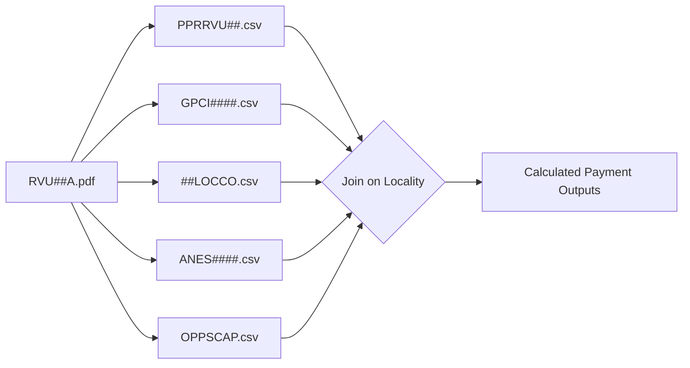

# CMS RVU / MPFS Baseline Reference (Universal Guideline)

*Note: This baseline file is designed for Render‑based ingestion (no S3 dependency) and aligns with the new three‑layer PDF extraction plan.*

**Source Family:** Medicare Physician Fee Schedule (MPFS)  
**Canonical Document:** `RVU##A.pdf` (e.g., RVU25A.pdf for CY2025)  
**Purpose:** Defines the structure, formulas, field mappings, and cross-dataset relationships used by all RVU-type ingestors.

---

## 🧩 1. Overview

Each annual RVU release (`RVU##A.zip`) defines the **national physician fee schedule** used to calculate Medicare reimbursements.

The package provides:
- Relative Value Units (RVUs)
- Payment Adjustment Rules
- Status Indicators
- Geographic Practice Cost Indices (GPCI)
- Locality Crosswalks
- Outpatient Payment Caps (OPPS)
- Anesthesia Conversion Factors
- Detailed record layouts and definitions (via `RVU##A.pdf`)

These documents form the structural backbone for **RVUIngestor**, **MPFSIngestor**, and **OPPSIngestor**.

Each CMS dataset scraper downloads its own PDF file, which may have a unique structure, section naming conventions, and layout format. The PDF extraction layer is designed to detect and adapt automatically to these structural variations to ensure accurate parsing. Correspondingly, the guidance generator stores separate schemas and guidance summaries per dataset family (such as `rvu25a`, `opps25a`, etc.) within the `/mnt/data/docs/guidelines/` directory on Render, enabling tailored ingestion workflows for each dataset type.


### Environment prerequisites
- Python 3.11 virtual environment created via `.venv/` (see `docs/dev_setup.md` for the bootstrap procedure).
- Homebrew libraries installed once per macOS host: `apache-arrow`, `snappy`, `tesseract`, `libomp`.
- Pinned Python dependencies (declared in `requirements.txt`): `pyarrow==16.1.0`, `fastparquet==2024.11.0`, `pandas==2.2.3`, plus the PDF/OCR stack (`pdfplumber`, `pdfminer.six`, `pypdf`, `pypdfium2`, `pytesseract`, `Pillow`).


---

## 1.1 PDF Extraction Architecture on Render

The PDF extraction follows a three-layer architecture deployed on Render’s persistent disk:

- **Reference Capture:** Raw PDF files (e.g., `RVU##A.pdf`) are stored under `/mnt/data/releases/` on Render, hashed (SHA256), and tagged with discovered metadata (page count, CMS posted date) for provenance.

- **Structured Layout Extraction:** Uses text-first parsing via `pdfplumber` (tabular extraction) with a fallback to `pdfminer.six` for narrative sections; if neither yields text above a configurable threshold the module escalates to OCR via `pytesseract`. Detected anchor headings (`DATA RECORD`, `ATTACHMENT`, `FILE ORGANIZATION`) establish section boundaries before field parsing.

- **Guidance Digest:** Emits versioned layout artifacts (`schema.json`, `schema.yaml`) and Markdown/JSON guidance summaries under `/mnt/data/docs/guidelines/`, incrementing the extraction tool version recorded by `guidance_summary`.

This architecture ensures all extraction artifacts remain local to Render without S3 dependencies, supporting reproducible ingestion workflows and traceable metadata for every release.

### 1.2 Extraction Module Contract

- **Entry point:** `python -m cms_pricing.ingestion.docs.pdf_reader --source <PDF> --release-id <rvu25a> --out <target_dir>`.
- **Outputs:** 
  - `schema.json` and `schema.yaml` (identical content) describing the layout artifact format in §6.3.
  - `guidance.json` and `guidance.md` consumable by `guidance_summary`.
  - `metadata.json` containing SHA256, page count, CMS published date, discovered section anchors, and tool/version metadata.
- **Section detection:** Regex anchors seeded from `STD-parser-contracts-prd-v1.11-ARCHIVED.md` plus per-release overrides stored in `cms_pricing/ingestion/docs/anchors/<release>.yaml`.
- **Failure policy:** Abort with non-zero exit when anchors cannot be located, when extracted field bounds differ from the existing registry by more than ±1 character, or when checksum comparison against stored metadata fails.
- **Local replay:** Accepts `--registry-path` to diff against `cms_pricing/validation/layout_registry.py` without touching network resources, enabling deterministic CI runs.

---

## ⚙️ 2. Payment Equations

All physician payment logic derives from five canonical formulas.

### 2.1 Non-Facility Payment
\[
Payment_{NF} = [(WorkRVU × WorkGPCI) + (NonFacilityPERVU × PEGPCI) + (MPRVU × MPGPCI)] × ConversionFactor
\]

### 2.2 Facility Payment
\[
Payment_{F} = [(WorkRVU × WorkGPCI) + (FacilityPERVU × PEGPCI) + (MPRVU × MPGPCI)] × ConversionFactor
\]

### 2.3 OPPS Imaging Cap
\[
Payment_{Capped} = \min(Payment_{MPFS}, Payment_{OPPSCap})
\]

### 2.4 Medicare Limiting Charge
\[
LimitingCharge = Payment × 1.0925
\]

### 2.5 Anesthesia Formula
\[
AnesthesiaPayment = (BaseUnits + TimeUnits) × AnesthesiaConversionFactor
\]

---

## 🧮 3. Files in Each Release

Each release ZIP follows this structure:

| File | Type | Description | Used By |
|------|------|--------------|---------|
| `RVU##A.pdf` / `.docx` | Documentation | Field layout, definitions, formulas, and policy indicators | `pdf_reader.py`, ingestor metadata |
| `PPRRVU##.csv` / `.txt` / `.xls` | Core Data | Relative value units, modifiers, status codes | `RVUIngestor` |
| `GPCI####.csv` / `.xls` / `.prn` | Data | Geographic Practice Cost Index by locality | `GPCIIngestor` |
| `##LOCCO.csv` / `.xls` / `.prn` | Data | County ↔︎ Locality crosswalk | `LocalityMapper` |
| `ANES####.csv` / `.xls` / `.txt` | Data | Anesthesia conversion factors | `AnesthesiaIngestor` |
| `OPPSCAP.csv` / `.xls` | Data | Outpatient imaging payment caps | `OPPSIngestor` |

### 3.1 Update Schedule
| Release | Month | Description |
|----------|--------|-------------|
| `RVU##A` | January | Main release |
| `RVU##AR` | January | Correction (if needed) |
| `RVU##B` | April | Q1 update |
| `RVU##C` | July | Q2 update |
| `RVU##D` | October | Q3 update |

### 3.2 Guidance Metadata & Provenance
- Store `metadata.json` next to each guidance bundle capturing: SHA256, page count, posted date, download URL, and ingestion timestamp.
- Persist diffs against the prior release in `diff_summary.md` to surface layout or policy deltas for reviewers.
- Feed page counts and posted dates to `guidance_summary` so downstream diagnostics can assert that the correct PDF powered a given ETL run.
- Maintain a `source_version` field (`2025A`, etc.) that threads through registry lookups, schema validation, and ingestion telemetry.

---

## 🧱 4. File Relationships



---

📂 5. Cross-File Field Mapping

Concept	Field(s)	Appears In	Description  
Procedure	HCPCS Code	PPRRVU, OPPSCAP	CPT/HCPCS identifier  
Modifier	Modifier	PPRRVU	Indicates component (-26, -TC)  
Locality	Locality ID / Carrier	GPCI, LOCCO	Regional adjustment key  
Conversion Factor	CF	ANES, PDF equations	Payment multiplier  
Facility Type	Facility / Non-Facility	PDF logic only	Setting for PE RVU selection  
OPPS Cap Fields	OPPS PE RVUs, OPPS MP RVUs	OPPSCAP	Used for imaging payment cap  

---

🧾 6. Field Mapping by Source Section

6.1 Data Record (Main Table)

Field	Position	Description	Appears In  
HCPCS Code	1–5	CPT/HCPCS procedure code	PPRRVU  
Modifier	6–7	-26 (Prof) / -TC (Tech) / blank = global	PPRRVU  
Description	8–57	Procedure name	PPRRVU  
Status Code	58	A/R/T = payable	PPRRVU  
Work RVU	60–65	Work component	PPRRVU  
Non-Facility PE RVU	67–72	Non-facility practice expense	PPRRVU  
Facility PE RVU	76–81	Facility practice expense	PPRRVU  
MP RVU	85–89	Malpractice component	PPRRVU  
PC/TC Indicator	103	Prof/Tech split flag	PPRRVU  
Global Surgery Code	104–106	000, 010, 090, etc.	PPRRVU  
Diagnostic Family	146–147	Imaging category (01–11)	PPRRVU  
OPPS PE/MP RVUs	152–164	For OPPS cap comparison	OPPSCAP  

6.2 Attachments

Attachment	Description	Used For  
Attachment A	Status Code definitions (A–X)	Payment logic  
PC/TC Indicator	Defines which codes can use -26/-TC	Parser validation  
Imaging Family Indicator	Identifies imaging service groups	OPPS cap rule  
Anesthesia Conversion Factors	Lists anesthesia CFs	ANES file cross-check  
Global Surgery Codes	Defines postoperative windows	RVU payment bundling  

6.3 Layout Artifact Schema (`schema.json` / `schema.yaml`)

```yaml
source_version: "2025A"
canonical_pdf: "RVU25A.pdf"
anchors:
  data_record:
    page: 12
    heading: "DATA RECORD LAYOUT"
  attachments:
    - name: "Attachment A – Status Codes"
      page: 42
layout:
  fields:
    - name: "hcpcs_code"
      start: 1
      end: 5
      type: "X(5)"
      description: "HCPCS procedure code"
      section: "data_record"
  enums:
    status_indicator:
      source: "Attachment A"
      values:
        - code: "A"
          meaning: "Active code — paid under the physician fee schedule if covered."
metadata:
  extracted_at: "2024-10-01T15:45:00Z"
  extractor_version: "pdf-reader@0.2.0"
  checksum_sha256: "..."
```

- `layout.fields[]` is the authoritative list consumed by parser registry tooling.
- `enums` and other policy groupings allow ingestion code to hydrate validation dictionaries without scraping attachments anew.
- The schema must round-trip between JSON and YAML representations with identical keys to simplify tooling.

---

🗺️ 7. Dataset Specifications

7.1 PPRRVU##

Purpose: Primary dataset of RVUs and payment policy indicators.

Key Groups:

Category	Fields	Description  
Identification	HCPCS, Modifier, Description	Core code identity  
RVUs	Work, PE (Facility/Non-Facility), MP	Core RVU components  
Indicators	Status, PC/TC, Global, Surgery, Bilateral, etc.	Payment adjustments  
OPPS	OPPS PE RVUs, MP RVUs	Imaging cap comparison fields  

---

7.2 GPCI####

Field	Description  
Locality ID	Local CMS locality number  
Work GPCI	Regional multiplier for work RVU  
PE GPCI	Regional multiplier for practice expense  
MP GPCI	Regional multiplier for malpractice  
Locality Name / State	Readable identifier  

---

7.3 ##LOCCO

Field	Description  
Carrier ID	CMS carrier code  
Locality ID	Matches GPCI file  
County Code	FIPS or equivalent  
County Name	Text name  
State	Abbreviation  

---

7.4 ANES####

Field	Description  
Locality ID	Locality  
Conversion Factor	CF for anesthesia  
Effective Date	As specified in PDF  

---

7.5 OPPSCAP

Field	Description  
HCPCS	Code  
OPPS Non-Facility PE RVU	Alt PE value  
OPPS Facility PE RVU	Alt facility value  
OPPS MP RVU	Alt malpractice value  
Payment Cap Amount	Used in imaging comparison  

---

🧠 8. Reference Relationships

Derived Field	Formula / Source	Input Files  
Payment_NonFacility	§2.1	PPRRVU + GPCI  
Payment_Facility	§2.2	PPRRVU + GPCI  
Payment_OPPS_Capped	§2.3	PPRRVU + OPPSCAP  
AnesthesiaPayment	§2.5	ANES  
LimitingCharge	§2.4	Derived post-payment  
LocalityName	Join on Locality	25LOCCO  
WorkGPCI, PEGPCI, MPGPCI	Direct lookup	GPCI  

---

🧭 9. Update Cadence & Versioning
- All datasets are versioned by Calendar Year (CY).  
- Quarterly updates (B, C, D) retain schema continuity.  
- Breaking schema changes (rare) are first introduced in the PDF layout (RVU##A.docx / .pdf).  
- The pdf_reader.py tool should validate:  
  - File count = 6  
  - Schema consistency across quarterly updates  
  - Revision notes for mid-year corrections  
  - Anchor presence for every required section with confidence scores logged to `ingestion.events`.
  - Layout diffs vs `layout_registry.py` with breakpoints emitted to PagerDuty when field bounds shift or enums change.
  - Checksum match against prior stored metadata; mismatch triggers quarantine of the release bundle until a human review completes.

---

🪄 10. Data Flow Summary

flowchart TD  
    A[RVU##A.pdf] -->|Defines fields and rules| B[PPRRVU##]  
    A --> C[GPCI####]  
    A --> D[##LOCCO]  
    A --> E[ANES####]  
    A --> F[OPPSCAP]  
    B -->|Join on HCPCS + Locality| G[Calculated Outputs]  
    C --> G  
    D --> G  
    E --> G  
    F --> G  
    G --> H[MPFS Curated Dataset]  

---

🧩 11. Application in Ingestors

Ingestor	Uses	Derived From  
RVUIngestor	Parses PPRRVU## and applies formula logic	PDF (Data Record, Attachment A)  
MPFSIngestor	Aggregates RVU + GPCI for localized payments	Equations + GPCI  
OPPSIngestor	Compares MPFS vs OPPS cap	Attachment + OPPSCAP  
AnesthesiaIngestor	Applies base/time × CF	ANES + PDF  
LocalityMapper	Joins county/locality	LOCCO + GPCI  

---

📘 12. Notes on Parsing PDFs
- Always extract DATA RECORD and ATTACHMENT sections first — they contain field definitions and policy rules.  
- Use section titles as anchors (DATA RECORD, ATTACHMENT A, FILE ORGANIZATION).  
- For each field, store:  
  - Name  
  - Start–End position  
  - Type (X(), 9.99)  
  - Description  
  - Source section  
- Normalize units and numeric fields to consistent data types (per DIS §3.4).  
- The PDF reader will store schema and guidance outputs under `/mnt/data/docs/guidelines/` on Render.  
- Record anchor detection results (`page`, `line`, `confidence`) in `metadata.json` to support debugging extraction drift.  
- Emit structured logs for every fallback (`pdfplumber` → `pdfminer.six` → OCR) so we can audit noisy PDFs quickly.  

---

## 13. Integration with Render & Guidance Summary Pipeline

The `pdf_reader` module is integrated into Render's ingestion pipeline by processing the canonical PDF files located on the Render persistent disk (`/mnt/data/releases/`). It extracts structured data and generates guidance files that encode parsing rules and field mappings. These guidance files are saved under `/mnt/data/docs/guidelines/` and consumed by the `guidance_summary` module. Together, they enable consistent, reproducible, and scalable ingestion of RVU datasets without reliance on external storage services. This integration supports automated validation, schema enforcement, and downstream processing within Render's environment.

**Render deployment flow**
- Render cron job downloads new release bundles, writes them to `/mnt/data/releases/<release>/`.
- `pdf_reader` runs immediately after download, producing artifacts under `/mnt/data/docs/guidelines/<release>/` and updating `metadata.json`.
- `guidance_summary` ingests the artifacts, updates stored summaries, and publishes telemetry so downstream jobs reference the correct schema.

**Local & CI workflow**
- Mirror the Render directory layout inside the repo (e.g., use `.local/docs/` and `.local/releases/`) and invoke `poetry run pdf-reader --source sample_data/rvu25a/RVU25A.pdf --release-id rvu25a --out artifacts/rvu25a_guidance`.
- Commit generated artifacts only when schema changes are intentional; otherwise treat diffs as failing tests.
- CI should call the module with `--registry-path cms_pricing/validation/layout_registry.py` and fail if diff output is non-empty, guaranteeing the registry stays in sync with authoritative PDFs.

**Environment parity**
- All tooling must operate without network access once the PDF is available locally.
- The same extractor binary and default configuration should ship to Render and run in CI to avoid drift.

---

## 14. Alerting & Observability
- Push structured events to `ingestion.events` with `event_type=pdf_guidance_extracted`, including release id, anchor confidence, and hash values.
- Emit `warning` level logs (and PagerDuty alerts in production) when anchor detection drops below the configured confidence threshold or when OCR fallback is required for more than 10% of pages.
- Record diff summaries as GitHub check annotations during CI so reviewers can see layout shifts inline with pull requests.
- Maintain a lightweight dashboard (Grafana/Metabase) that surfaces recent PDF ingestions, validation failures, and time-to-review metrics.
