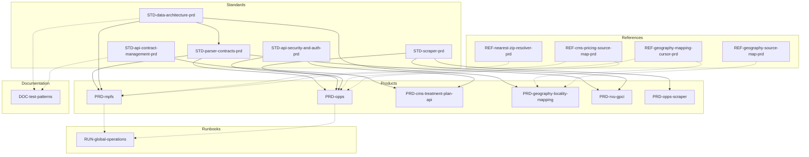
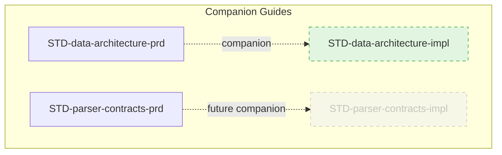

# Master System Catalog & Architectural Map

**Status:** Adopted v1.0.5  
**Owners:** Platform Architecture  
**Consumers:** Engineering, Product, Data, QA, Ops, Compliance  
**Change control:** ADR + Architecture Owner approval  
**Review cadence:** Monthly (first business Monday) — **Last reviewed:** 2025-10-15  

> Core governance (`STD-doc-governance-prd-v1.0.md`) defines naming and metadata rules. This catalog is a navigational index and dependency map only.

---

## 1. Architectural Standards (`STD-*`)

| Document | Status | Owner | Last Reviewed | Notes |
|---|---|---|---|---|
| `STD-doc-governance-prd-v1.0.md` | Draft v1.0.1 | Platform | 2025-10-15 | Added companion doc conventions |
| `STD-data-architecture-prd-v1.0.md` | Adopted 1.0 | Data Engineering | 2025-10-15 | Main standard |
| `STD-data-architecture-impl-v1.0.md` | Draft v1.0 | Data Engineering | 2025-10-15 | Implementation guide (companion) |
| `STD-parser-contracts-prd-v1.0.md` | Draft v1.0 | Data Platform Engineering | 2025-10-15 | Shared parser contracts, metadata injection, tiered validation |
| `STD-api-contract-management-prd-v1.0.md` | Adopted v1.0 | Platform Engineering | 2025-09-30 | |
| `STD-api-architecture-prd-v1.0.md` | Adopted v1.0 | Platform Engineering | 2025-09-30 | |
| `STD-api-security-and-auth-prd-v1.0.md` | Draft v1.0 (for approval) | Security | 2025-09-30 | |
| `STD-api-performance-scalability-prd-v1.0.md` | Adopted v1.0 | SRE | 2025-09-30 | |
| `STD-observability-monitoring-prd-v1.0.md` | Adopted v1.0 | SRE | 2025-09-30 | |
| `STD-qa-testing-prd-v1.0.md` | Draft v1.0 (proposed) | QA Guild | 2025-09-30 | |
| `STD-scraper-prd-v1.0.md` | Draft v1.1 | Data Engineering | 2025-10-15 | Updated with implementation patterns |

---

## 2. Reference Architectures (`REF-*`)

| Document | Status | Owner | Notes |
|---|---|---|---|
| `REF-scraper-ingestor-integration-v1.0.md` | Draft v1.0 | Data Engineering | Scraper→ingestor handoff patterns, manifest contract |
| `REF-geography-mapping-cursor-prd-v1.0.md` | Draft v1.0 | Data Engineering | ZIP→locality ingestion/resolver pack |
| `REF-nearest-zip-resolver-prd-v1.0.md` | Draft v1.0 | Data Engineering | Same-state nearest ZIP algorithm |
| `REF-cms-pricing-source-map-prd-v1.0.md` | Draft v1.0 | Pricing Platform Engineering | CMS pricing datasets, links, work-backwards checklist |
| `REF-geography-source-map-prd-v1.0.md` | Draft v1.0 | Pricing Platform Engineering | Geography dataset map & checklist |

---

## 3. Product & Dataset PRDs (`PRD-*`)

| Document | Status | Owner | Hard Dependencies | Soft Dependencies |
|---|---|---|---|---|
| `PRD-mpfs-prd-v1.0.md` | Draft v1.0 | Product Engineering | `STD-data-architecture`, `SRC-cms-rvu` | `REF-nearest-zip-resolver-prd-v1.0.md` |
| `PRD-opps-prd-v1.0.md` | Draft v1.0 | Product Engineering | `STD-scraper`, `STD-api-security-and-auth`, `SRC-opps` | `REF-geography-mapping-cursor-prd-v1.0.md` |
| `PRD-ncci-mue-prd-v1.0.md` | Draft v1.0 | Product Engineering | `STD-data-architecture`, `SRC-ncci` | — |
| `PRD-cms-treatment-plan-api-prd-v0.1.md` | Draft v0.1 | Product Engineering | `STD-api-contract-management`, `STD-api-security-and-auth` | — |
| `PRD-geography-locality-mapping-prd-v1.0.md` | Draft v1.0 | Product Engineering | `STD-data-architecture`, `SRC-gazetteer` | `REF-geography-mapping-cursor-prd-v1.0.md` |
| `PRD-rvu-gpci-prd-v0.1.md` | Draft v0.2 | Product Engineering | `STD-scraper`, `SRC-gpci`, `SRC-carrier-localities` | — |
| `PRD-opps-scraper-prd-v1.0.md` | Draft v1.0 | Data Engineering | `STD-scraper`, `SRC-opps` | — |

---

## 4. Operational Runbooks (`RUN-*`)

| Document | Status | Owner | Scope |
|---|---|---|---|
| `RUN-global-operations-prd-v1.0.md` | Draft v1.0 | Ops + Data Engineering | Go-live validation, paging, rollback |

---

## 5. Documentation & Meta (`DOC-*`)

| Document | Status | Owner | Purpose |
|---|---|---|---|
| `DOC-master-catalog-prd-v1.0.md` | Adopted v1.0 | Architecture | Master index (this document) |
| `DOC-test-patterns-prd-v1.0.md` | Draft v1.0 (proposed) | QA Guild | Test patterns and best practices guide |
| `CHANGELOG.md` | Active | Platform Engineering | Project release notes (Keep a Changelog format) |

---

## 6. Source Descriptors (`SRC-*`) — pending authorship

| Document | Source / Type | Owner | Status |
|---|---|---|---|
| `SRC-gazetteer.md` | Census Gazetteer ZIP | Data Engineering | Placeholder v0.1 |
| `SRC-cms-rvu.md` | CMS MPFS RVU exports | Data Engineering | Placeholder v0.1 |
| `SRC-opps.md` | CMS OPPS addenda | Data Engineering | Placeholder v0.1 |
| `SRC-ncci.md` | NCCI / MUE update files | Data Engineering | Placeholder v0.1 |
| `SRC-gpci.md` | GPCI indices & locality tables | Data Engineering | Placeholder v0.1 |
| `SRC-carrier-localities.md` | Carrier ↔ locality crosswalk | Data Engineering | Placeholder v0.1 |

---

## 7. Dependency Graph

### 7.1 Companion Relationships

Standards may have companion implementation guides providing detailed patterns, code examples,
and integration guardrails. These are **not dependencies** but supplemental "how-to" documentation.

**Key Principle:** Main dependency graph shows hard dependencies only. Companion relationships
are documented separately to maintain signal clarity and prevent graph clutter.

**Legend:**
- **Solid nodes** = Published documents
- **Dotted nodes** = Future/planned documents  
- **Dotted edges** (`-.companion.->`) = "companion" relationship (NOT a dependency)
- **Green fill** = Implementation guide available
- **Gray fill** = Planned but not yet created

**Key Distinction:**
- **Dependency edge** (solid arrow in §7 main graph): A depends on B → must read B to understand A's requirements
- **Companion edge** (dotted arrow in §7.1): B supplements A → how-to guide, code examples, not required reading

**Discovery Mechanisms:**
- **Markdown metadata:** `**Companion Docs:**` and `**Companion Of:**` fields in headers
- **Callouts:** "For Implementers" sections in standard documents
- **Visual graph:** This subgraph for human wayfinding
- **Keywords:** Implementation guides include "how to implement", "integration patterns", etc. in first paragraph for AI/RAG recall

**Audit Enforcement:** CI validates bidirectional companion links (see §8.3).

---

## 8. Automation & Compliance Checks

### 8.1 Documentation Audits

- `tools/audit_doc_catalog.py` verifies catalog consistency (run manually or in CI).  
- `.github/workflows/doc-catalog-audit.yml` executes weekly (Monday 12:00 UTC) and on demand; fails the build on inconsistencies.  
- Pre-commit hooks enforce filename prefixes and header metadata (`tools/verify-prd-headers.sh`).  
- `tools/update-prd-refs.sh` bulk-updates references after renames.

### 8.2 Cross-Reference Validation

- `tools/audit_cross_references.py` validates all PRD cross-references
- `tools/audit_doc_links.py` checks for broken markdown links
- Run on every PR + daily schedule

### 8.3 Companion Link Validation

**Tools:** `tools/audit_doc_catalog.py`

**Checks:**
1. **Bidirectional symmetry:** Every `**Companion Docs:**` entry has matching `**Companion Of:**` in target doc
2. **File existence:** All companion references point to existing files (case-sensitive paths)
3. **Document Type consistency:** Implementation guides have `**Document Type:** Implementation Guide`

**Fail Conditions:**
- Missing companion file (hard error)
- One-way companion link / not bidirectional (hard error)
- Broken markdown link in companion field (hard error)

**Implementation:** Simple regex parsing (same pattern as `**Status:**` field)

**Schedule:** Runs on every PR + daily at 00:00 UTC

**Rename Safety:**
- When renaming a PRD file, `tools/update-prd-refs.sh` MUST update:
  * All `**Companion Docs:**` fields pointing to the old filename
  * All `**Companion Of:**` fields pointing to the old filename
  * Cross-references in other documents
- CI MUST fail if companion links are broken after rename (audit catches stale references)
- Audit runs on every PR to prevent merge of broken links

**Path Validation:**
- Links MUST be case-sensitive (exact match) even on macOS
- Links MUST NOT contain `../`, `/`, or `http://` (local docs only)
- CI catches case mismatches that work locally but break on Linux

---

## 9. Change Log

| Version | Date | Summary | PR |
|---|---|---|---|
| 1.0.5 | 2025-10-16 | Added CHANGELOG.md to §5 Documentation & Meta (project release notes following Keep a Changelog format); Updated STD-doc-governance to v1.0.2 with CHANGELOG.md requirement (§5.1); Added automated validation via tools/audit_changelog.py. Supports Phase 0 lockdown milestone (v0.1.0-phase0). | #TBD |
| 1.0.4 | 2025-10-15 | Added STD-parser-contracts-prd-v1.0.md (shared parser infrastructure standard for CMS data ingestion); updated dependency graph showing parser contracts as foundation for MPFS, RVU, OPPS ingestors; establishes public contract requirements, metadata injection pattern, and tiered validation standards. | #TBD |
| 1.0.3 | 2025-10-15 | Added REF-scraper-ingestor-integration-v1.0.md (scraper→ingestor handoff reference); updated STD-doc-governance to allow REF docs without `-prd` suffix; updated dependency graph with new REF document and integration relationships. | #TBD |
| 1.0.2 | 2025-10-15 | Added STD-data-architecture-impl-v1.0.md (companion implementation guide); updated STD-doc-governance to v1.0.1 with companion document conventions; updated STD-scraper to v1.1; added companion relationships to dependency graph. | #TBD |
| 1.0.1 | 2025-10-02 | Added automation notes, DOC/self entry, dependency refresh, and metadata alignment. | #TBD |
| 1.0.0 | 2025-09-01 | Initial adoption of master catalog. | #TBD |

---

## 10. Deprecation Policy

- Mark deprecated docs with `Status: Deprecated` and record the date in the header.  
- Provide migration path or ADR reference explaining the retirement.  
- Move deprecated docs to an archive table after the next audit cycle but retain history in Git.
