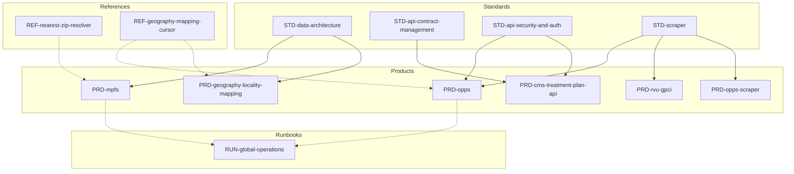

# Master System Catalog & Architectural Map

**Status:** Adopted v1.0  
**Owners:** Platform Architecture  
**Consumers:** Engineering, Product, Data, QA, Ops, Compliance  
**Change control:** ADR + Architecture Owner approval  
**Review cadence:** Monthly (first business Monday) — **Last reviewed:** 2025-10-02  

> Core governance (`STD-doc-governance_prd_v1.0.md`) defines naming and metadata rules. This catalog is a navigational index and dependency map only.

---

## 1. Architectural Standards (`STD-*`)

| Document | Status | Owner | Last Reviewed |
|---|---|---|---|
| `STD-doc-governance_prd_v1.0.md` | Draft v1.0 (proposed) | Platform | 2025-09-30 |
| `STD-data-architecture_prd_v1.0.md` | Adopted 1.0 | Data Engineering | 2025-09-30 |
| `STD-api-contract-management_prd_v1.0.md` | Adopted v1.0 | Platform Engineering | 2025-09-30 |
| `STD-api-architecture_prd_v1.0.md` | Adopted v1.0 | Platform Engineering | 2025-09-30 |
| `STD-api-security-and-auth_prd_v1.0.md` | Draft v1.0 (for approval) | Security | 2025-09-30 |
| `STD-api-performance-scalability_prd_v1.0.md` | Adopted v1.0 | SRE | 2025-09-30 |
| `STD-observability-monitoring_prd_v1.0.md` | Adopted v1.0 | SRE | 2025-09-30 |
| `STD-qa-testing_prd_v1.0.md` | Draft v1.0 (proposed) | QA Guild | 2025-09-30 |
| `STD-scraper_prd_v1.0.md` | Draft v1.0 | Data Engineering | 2025-09-30 |

---

## 2. Reference Architectures (`REF-*`)

| Document | Status | Owner | Notes |
|---|---|---|---|
| `REF-geography-mapping-cursor_prd_v1.0.md` | Draft v1.0 | Data Engineering | ZIP→locality ingestion/resolver pack |
| `REF-nearest-zip-resolver_prd_v1.0.md` | Draft v1.0 | Data Engineering | Same-state nearest ZIP algorithm |

---

## 3. Product & Dataset PRDs (`PRD-*`)

| Document | Status | Owner | Hard Dependencies | Soft Dependencies |
|---|---|---|---|---|
| `PRD-mpfs_prd_v1.0.md` | Draft v1.0 | Product Engineering | `STD-data-architecture`, `SRC-cms-rvu` | `REF-nearest-zip-resolver_prd_v1.0.md` |
| `PRD-opps_prd_v1.0.md` | Draft v1.0 | Product Engineering | `STD-scraper`, `STD-api-security-and-auth`, `SRC-opps` | `REF-geography-mapping-cursor_prd_v1.0.md` |
| `PRD-ncci-mue_prd_v1.0.md` | Draft v1.0 | Product Engineering | `STD-data-architecture`, `SRC-ncci` | — |
| `PRD-cms-treatment-plan-api_prd_v0.1.md` | Draft v0.1 | Product Engineering | `STD-api-contract-management`, `STD-api-security-and-auth` | — |
| `PRD-geography-locality-mapping_prd_v1.0.md` | Draft v1.0 | Product Engineering | `STD-data-architecture`, `SRC-gazetteer` | `REF-geography-mapping-cursor_prd_v1.0.md` |
| `PRD-rvu-gpci_prd_v0.1.md` | Draft v0.2 | Product Engineering | `STD-scraper`, `SRC-gpci`, `SRC-carrier-localities` | — |
| `PRD-opps-scraper_prd_v1.0.md` | Draft v1.0 | Data Engineering | `STD-scraper`, `SRC-opps` | — |

---

## 4. Operational Runbooks (`RUN-*`)

| Document | Status | Owner | Scope |
|---|---|---|---|
| `RUN-global-operations_prd_v1.0.md` | Draft v1.0 | Ops + Data Engineering | Go-live validation, paging, rollback |

---

## 5. Documentation & Meta (`DOC-*`)

| Document | Status | Owner | Purpose |
|---|---|---|---|
| `DOC-master-catalog_prd_v1.0.md` | Adopted v1.0 | Architecture | Master index (this document) |

---

## 6. Source Descriptors (`SRC-*`) — pending authorship

| Document | Source / Type | Owner | Status |
|---|---|---|---|
| `SRC-gazetteer.md` | Census Gazetteer ZIP | Data Engineering | TODO |
| `SRC-cms-rvu.md` | CMS MPFS RVU exports | Data Engineering | TODO |
| `SRC-opps.md` | CMS OPPS addenda | Data Engineering | TODO |
| `SRC-ncci.md` | NCCI / MUE update files | Data Engineering | TODO |
| `SRC-gpci.md` | GPCI indices & locality tables | Data Engineering | TODO |
| `SRC-carrier-localities.md` | Carrier ↔ locality crosswalk | Data Engineering | TODO |

> Placeholder rows remain until the corresponding `SRC-*` docs are created. Linked PRDs should reference primary CMS docs in the meantime.

---

## 7. Dependency Graph

---

## 8. Automation & Compliance Checks

- `tools/audit_doc_catalog.py` verifies catalog consistency (run manually or in CI).  
- `.github/workflows/doc-catalog-audit.yml` executes weekly (Monday 12:00 UTC) and on demand; fails the build on inconsistencies.  
- Pre-commit hooks enforce filename prefixes and header metadata (`tools/verify-prd-headers.sh`).  
- `tools/update-prd-refs.sh` bulk-updates references after renames.

---

## 9. Change Log

| Version | Date | Summary | PR |
|---|---|---|---|
| 1.0.2 | 2025-10-02 | Added automation notes, DOC/self entry, dependency refresh, and metadata alignment. | #TBD |
| 1.0.1 | 2025-09-30 | Adopted automated audit workflow; aligned tables and dependencies. | #TBD |
| 1.0.0 | 2025-09-01 | Initial adoption of master catalog. | #TBD |

---

## 10. Deprecation Policy

- Mark deprecated docs with `Status: Deprecated` and record the date in the header.  
- Provide migration path or ADR reference explaining the retirement.  
- Move deprecated docs to an archive table after the next audit cycle but retain history in Git.
