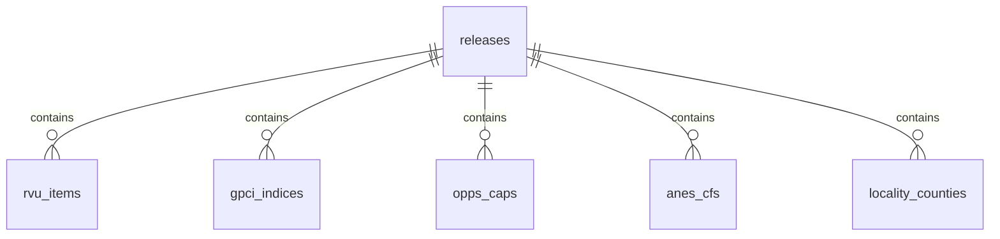

# RVU Database Schema Reference

**Status:** Draft v1.0  
**Owners:** Data Engineering, Platform Engineering  
**Consumers:** API Developers, Data Engineers, QA Engineers  
**Change control:** PR review  
**Last Updated:** 2025-10-27

**Cross-References:**
- **Catalog:** `DOC-master-catalog-prd-v1.0.md` – Master index
- **Models:** `cms_pricing/models/rvu.py` - SQLAlchemy model definitions
- **Ingestion:** `cms_pricing/ingestion/ingestors/rvu_ingestor.py` - Database loading logic
- **PRD:** `prds/PRD-rvu-gpci-prd-v0.1.md` - Product requirements
- **Standard:** `prds/STD-database-platform-prd-v1.0.md` - Database platform standard
- **Migrations:** `alembic/versions/` - Alembic migration files

---

## 1. Overview

This document provides a complete reference for the RVU database schema used in the CMS Pricing API. The schema stores all RVU-related data including PPRRVU items, GPCI indices, OPPS caps, Anesthesia conversion factors, and locality mappings.

### 1.1 Database Structure

The RVU database contains **6 tables** organized as follows:

```
releases (parent)
├── rvu_items
├── gpci_indices
├── opps_caps
├── anes_cfs
└── locality_counties
```

All child tables have a foreign key relationship to `releases`, creating a hierarchical structure where each release contains datasets from a specific CMS publication.

### 1.2 Field Provenance & Ownership

Each schema field SHOULD be traceable to its original CMS column name or requirement. Provenance is documented using:

- Inline comments in SQLAlchemy models
- `x-source-doc` or `x-column-justification` (for OpenAPI overlay)
- Linked PRDs (see §8)

Schema ownership is shared between Data Engineering (models, ingestion, constraints) and Platform/API teams (semantics, availability). Ownership mapping is defined in `STD-database-platform-prd-v1.0.md`.

### 1.3 Guidance Artifacts & Summaries

Every RVU release ships with one or more CMS PDF guidance documents (e.g., `RVU25A.pdf`) that explain the payment formula, status indicators, and file inventory. The ingestion pipeline now:

- Stores the original PDFs under `data/ingestion/<env>/docs/cms_rvu/<release_id>/raw/`.
- Emits a `docs_manifest.json` describing each document with comprehensive metadata:
  - **File identity:** filename, path, sha256, size_bytes, content_type, file_type
  - **Source traceability:** url, last_modified, etag, posted_at
  - **PDF metadata:** pdf_page_count (extracted via pypdf)
  - **Lineage tracking:** 
    - `lineage.discovery_manifest_path` - Links to discovery manifest that found the PDF
    - `lineage.ingestion_batch_id` - Links to ingestion batch that processed the PDF
  - **Additional metadata:** scraper-discovered metadata (year, quarter, revision, display_name)
- Generates companion summaries (`summary.md` + `summary.json`) that extract:
  - Release metadata (effective date, update date, conversion factor).
  - Dataset inventory (PPRRVU, GPCI, OPPSCAP, ANES, locality) with file variants.
  - Physician Fee Schedule payment equation and RVU component definitions.
  - Status indicator, global period, and policy legends.
  - Important disclaimers (AMA/ADA copyright, sequestration notes) and CMS support contacts.
  - **Processing metadata:**
    - `summary_metadata.generated_at` - When summary was created
    - `summary_metadata.generator_version` - Version of summary generator
    - `summary_metadata.extraction_tool_version` - Version of PDF extraction tool (when implemented)
    - `ingestion_batch_id` - Links summary to ingestion batch
    - `extraction_tool_version` - Tracks tool version used for extraction

The `docs_manifest.json` also includes a top-level `discovery_manifest_path` field linking the entire guidance document set to the discovery run.

Downstream consumers SHOULD reference these artifacts when documenting or troubleshooting schema fields. The latest summary paths are also surfaced in the published `manifest.json → guidance_docs` array and observability payloads.

---

## 2. Tables

### 2.1 releases

**Purpose:** Tracks RVU data release metadata

**Primary Key:** `id` (UUID)

**Columns:**

| Column | Type | Nullable | Description |
|--------|------|----------|-------------|
| `id` | UUID | NO | Primary key |
| `type` | String(20) | NO | Release type (RVU_FULL, GPCI, etc.) |
| `source_version` | String(10) | NO | CMS version (e.g., "2025D") |
| `imported_at` | Date | NO | Import timestamp |
| `notes` | Text | YES | Optional notes |

**Indexes:**
- `idx_releases_type` - On `type`
- `idx_releases_source_version` - On `source_version`
- `idx_releases_imported_at` - On `imported_at`

**Relationships:**
- One-to-many with `rvu_items`, `gpci_indices`, `opps_caps`, `anes_cfs`, `locality_counties`

**Example:**
```sql
SELECT * FROM releases WHERE source_version = '2025D';
```

---

### 2.2 rvu_items

**Purpose:** Stores PPRRVU data (Physician/Practitioner Relative Value Units)

**Primary Key:** `id` (UUID)

**Foreign Key:** `release_id` → `releases.id`

**Natural Key:** `(hcpcs_code, modifier, effective_start)` (logical, not DB constraint)

**Columns:**

| Column | Type | Nullable | Description |
|--------|------|----------|-------------|
| `id` | UUID | NO | Primary key |
| `release_id` | UUID | NO | FK to releases |
| `hcpcs_code` | String(5) | NO | HCPCS code (e.g., "99213") |
| `modifiers` | ARRAY(String) | YES | Array of modifiers |
| `modifier_key` | String(10) | YES | Normalized modifier key |
| `description` | Text | YES | Code description |
| `status_code` | String(2) | YES | Status (A/R/T) |
| `work_rvu` | Numeric(10,4) | YES | Work RVU |
| `pe_rvu_nonfac` | Numeric(10,4) | YES | PE RVU non-facility |
| `pe_rvu_fac` | Numeric(10,4) | YES | PE RVU facility |
| `mp_rvu` | Numeric(10,4) | YES | Malpractice RVU |
| `na_indicator` | String(1) | YES | NA indicator |
| `global_days` | String(3) | YES | Global period days |
| `bilateral_ind` | String(1) | YES | Bilateral indicator |
| `multiple_proc_ind` | String(1) | YES | Multiple procedure indicator |
| `assistant_surg_ind` | String(1) | YES | Assistant surgeon indicator |
| `co_surg_ind` | String(1) | YES | Co-surgeon indicator |
| `team_surg_ind` | String(1) | YES | Team surgeon indicator |
| `endoscopic_base` | String(1) | YES | Endoscopic base |
| `conversion_factor` | Numeric(10,4) | YES | Conversion factor |
| `physician_supervision` | String(2) | YES | Physician supervision |
| `diag_imaging_family` | String(10) | YES | Diagnostic imaging family |
| `total_nonfac` | Numeric(10,2) | YES | Total non-facility |
| `total_fac` | Numeric(10,2) | YES | Total facility |
| `effective_start` | Date | YES | Effective start date |
| `effective_end` | Date | YES | Effective end date |
| `source_file` | String(100) | YES | Source filename |
| `row_num` | Integer | YES | Original row number |

**Indexes:**
- `idx_rvu_items_hcpcs` - On `hcpcs_code`
- `idx_rvu_items_status` - On `status_code`
- `idx_rvu_items_effective` - On `effective_start, effective_end`
- `idx_rvu_items_release_hcpcs` - On `release_id, hcpcs_code`

**Example:**
```sql
SELECT * FROM rvu_items 
WHERE hcpcs_code = '99213' 
  AND effective_start <= CURRENT_DATE 
  AND (effective_end IS NULL OR effective_end >= CURRENT_DATE);
```

**Typical Row Count:** ~16,000-20,000 per release

---

### 2.3 gpci_indices

**Purpose:** Stores Geographic Practice Cost Indices by MAC and locality

**Primary Key:** `id` (UUID)

**Foreign Key:** `release_id` → `releases.id`

**Natural Key:** `(mac, locality_id, effective_start)` - UNIQUE constraint

**Columns:**

| Column | Type | Nullable | Description |
|--------|------|----------|-------------|
| `id` | UUID | NO | Primary key |
| `release_id` | UUID | NO | FK to releases |
| `mac` | String(10) | NO | MAC (5 digits) |
| `state` | String(2) | NO | State code |
| `locality_id` | String(10) | NO | Locality code |
| `locality_name` | String(100) | YES | Locality name |
| `work_gpci` | Numeric(10,4) | YES | Work GPCI |
| `pe_gpci` | Numeric(10,4) | YES | PE GPCI |
| `mp_gpci` | Numeric(10,4) | YES | MP GPCI |
| `effective_start` | Date | YES | Effective start date |
| `effective_end` | Date | YES | Effective end date |
| `source_file` | String(100) | YES | Source filename |
| `row_num` | Integer | YES | Original row number |

**Indexes:**
- `idx_gpci_mac_locality` - On `mac, locality_id`
- `idx_gpci_state` - On `state`
- `idx_gpci_effective` - On `effective_start, effective_end`
- `idx_gpci_release_mac` - On `release_id, mac`
- `uq_gpci_mac_locality_effective` - UNIQUE on `mac, locality_id, effective_start`

**Note:** The unique constraint on `(mac, locality_id, effective_start)` prevents false duplicates where `locality_code='00'` appears in multiple states (see GPCI v1.3 migration).

**Example:**
```sql
SELECT * FROM gpci_indices 
WHERE mac = '10112' 
  AND locality_id = '99';
```

**Typical Row Count:** ~114 rows per release (one per MAC/locality combination)

---

### 2.4 opps_caps

**Purpose:** Stores OPPS-based Payment Caps by HCPCS and locality

**Primary Key:** `id` (UUID)

**Foreign Key:** `release_id` → `releases.id`

**Natural Key:** `(hcpcs_code, modifier, mac, locality_code, effective_start)` (logical)

**Columns:**

| Column | Type | Nullable | Description |
|--------|------|----------|-------------|
| `id` | UUID | NO | Primary key |
| `release_id` | UUID | NO | FK to releases |
| `hcpcs_code` | String(5) | NO | HCPCS code |
| `modifier` | String(2) | YES | Modifier |
| `proc_status` | String(2) | YES | Procedure status |
| `mac` | String(10) | NO | MAC code |
| `locality_id` | String(10) | NO | Locality code |
| `price_fac` | Numeric(10,2) | YES | Facility price |
| `price_nonfac` | Numeric(10,2) | YES | Non-facility price |
| `effective_start` | Date | YES | Effective start date |
| `effective_end` | Date | YES | Effective end date |
| `source_file` | String(100) | YES | Source filename |
| `row_num` | Integer | YES | Original row number |

**Indexes:**
- `idx_opps_hcpcs` - On `hcpcs_code`
- `idx_opps_mac_locality` - On `mac, locality_id`
- `idx_opps_effective` - On `effective_start, effective_end`
- `idx_opps_release_hcpcs` - On `release_id, hcpcs_code`

**Example:**
```sql
SELECT * FROM opps_caps 
WHERE hcpcs_code = '36415' 
  AND mac = '10112';
```

**Typical Row Count:** ~500-2,000 per release

---

### 2.5 anes_cfs

**Purpose:** Stores Anesthesia Conversion Factors by MAC and locality

**Primary Key:** `id` (UUID)

**Foreign Key:** `release_id` → `releases.id`

**Natural Key:** `(mac, locality_id, effective_start)` (logical)

**Columns:**

| Column | Type | Nullable | Description |
|--------|------|----------|-------------|
| `id` | UUID | NO | Primary key |
| `release_id` | UUID | NO | FK to releases |
| `mac` | String(10) | NO | MAC code |
| `locality_id` | String(10) | NO | Locality code |
| `locality_name` | String(100) | YES | Locality name |
| `anesthesia_cf` | Numeric(10,4) | YES | Anesthesia conversion factor |
| `effective_start` | Date | YES | Effective start date |
| `effective_end` | Date | YES | Effective end date |
| `source_file` | String(100) | YES | Source filename |
| `row_num` | Integer | YES | Original row number |

**Indexes:**
- `idx_anes_mac_locality` - On `mac, locality_id`
- `idx_anes_effective` - On `effective_start, effective_end`
- `idx_anes_release_mac` - On `release_id, mac`

**Example:**
```sql
SELECT * FROM anes_cfs 
WHERE mac = '10112' 
  AND locality_id = '99';
```

**Typical Row Count:** ~114 rows per release

---

### 2.6 locality_counties

**Purpose:** Stores Locality to County crosswalk data

**Primary Key:** `id` (UUID)

**Foreign Key:** `release_id` → `releases.id`

**Natural Key:** `(mac, locality_id, state)` (logical)

**Columns:**

| Column | Type | Nullable | Description |
|--------|------|----------|-------------|
| `id` | UUID | NO | Primary key |
| `release_id` | UUID | NO | FK to releases |
| `mac` | String(10) | NO | MAC code |
| `locality_id` | String(10) | NO | Locality code |
| `state` | String(2) | NO | State code |
| `fee_schedule_area` | String(10) | YES | Fee schedule area |
| `county_name` | String(100) | YES | County name |
| `effective_start` | Date | YES | Effective start date |
| `effective_end` | Date | YES | Effective end date |
| `source_file` | String(100) | YES | Source filename |
| `row_num` | Integer | YES | Original row number |

**Indexes:**
- `idx_locco_mac_locality` - On `mac, locality_id`
- `idx_locco_state` - On `state`
- `idx_locco_effective` - On `effective_start, effective_end`
- `idx_locco_release_mac` - On `release_id, mac`

**Example:**
```sql
SELECT * FROM locality_counties 
WHERE state = 'CA' 
  AND locality_id = '99';
```

**Typical Row Count:** ~3,500 rows per release (exploded county-level data)

---

## 3. Relationships

### 3.1 Entity Relationship



> For interactive schema exploration, see dbdiagram.io link in project wiki or ERD export in `/docs/diagrams/rvu_schema.png`.

### 3.2 Join Examples

**Get RVU data with release info:**
```sql
SELECT r.*, re.source_version, re.imported_at
FROM rvu_items r
JOIN releases re ON r.release_id = re.id
WHERE r.hcpcs_code = '99213';
```

**Get GPCI for a specific MAC/locality:**
```sql
SELECT * FROM gpci_indices
WHERE mac = '10112' 
  AND locality_id = '99'
  AND effective_start <= CURRENT_DATE
  AND (effective_end IS NULL OR effective_end >= CURRENT_DATE);
```

**Get all data for a specific release:**
```sql
SELECT 
    'rvu_items' as table_name, COUNT(*) as row_count
FROM rvu_items WHERE release_id = '<release_uuid>'
UNION ALL
SELECT 'gpci_indices', COUNT(*) FROM gpci_indices WHERE release_id = '<release_uuid>'
UNION ALL
SELECT 'opps_caps', COUNT(*) FROM opps_caps WHERE release_id = '<release_uuid>'
UNION ALL
SELECT 'anes_cfs', COUNT(*) FROM anes_cfs WHERE release_id = '<release_uuid>'
UNION ALL
SELECT 'locality_counties', COUNT(*) FROM locality_counties WHERE release_id = '<release_uuid>';
```

---

## 4. Natural Keys & Constraints

### 4.1 Natural Keys

**Purpose:** Natural keys identify unique business entities across releases.

| Table | Natural Key | Notes |
|-------|-------------|-------|
| `rvu_items` | `(hcpcs_code, modifier, effective_start)` | Not enforced as DB constraint |
| `gpci_indices` | `(mac, locality_id, effective_start)` | **Unique constraint enforced** |
| `opps_caps` | `(hcpcs_code, modifier, mac, locality_id, effective_start)` | Not enforced |
| `anes_cfs` | `(mac, locality_id, effective_start)` | Not enforced |
| `locality_counties` | `(mac, locality_id, state)` | Not enforced |

### 4.2 Unique Constraints

**Only `gpci_indices` has a database-enforced unique constraint:**
```sql
CREATE UNIQUE INDEX uq_gpci_mac_locality_effective 
ON gpci_indices (mac, locality_id, effective_start);
```

**Why:** Prevents false duplicates where `locality_code='00'` appears in multiple states. This was the GPCI v1.3 migration fix (see `alembic/versions/003_gpci_v13_add_mac_to_nk.py`).

### 4.3 Constraints & Guardrails

- **Foreign keys**: Enforced from child tables to `releases` to guarantee referential integrity.
- **Not-null fields**: Enforced on primary keys, join keys, and required identifiers like `hcpcs_code`, `mac`.
- **Check constraints**: Currently handled in application logic but planned for future migrations.
- **Soft natural keys**: Used where uniqueness is contextual or spans external business rules. These are documented but not DB-enforced.

---

## 5. Data Loading

### 5.1 Loading Process

Data is loaded via the RVU ingestor's `publish()` method:

1. **Create Release record** - Metadata tracked in `releases` table
2. **Load each dataset** - DataFrames loaded into respective tables
3. **Batch commits** - Commits every 1,000 rows for performance
4. **Progress logging** - Logs every 10,000 rows
5. **Error handling** - Continues on individual record failures

**Performance Optimization:**
- Use bulk insert operations (`executemany` or pandas `to_sql()` with `method='multi'`) instead of row-by-row inserts
- Pre-validate data types and constraints in pandas before database writes to reduce round-trips
- For large datasets (100k+ rows), consider chunking DataFrames and parallel processing where safe

### 5.2 Loading Methods

Located in `cms_pricing/ingestion/ingestors/rvu_ingestor.py`:

- `_load_dataframes_to_database()` - Orchestrator
- `_load_pprrvu_data()` - Loads RVU items
- `_load_gpci_data()` - Loads GPCI indices
- `_load_oppscap_data()` - Loads OPPS caps
- `_load_anes_data()` - Loads ANES conversion factors
- `_load_locality_data()` - Loads locality mappings

### 5.3 Column Mapping

DataFrames are mapped to SQLAlchemy models with type conversions:

- **Dates** - Converted from strings to `Date` objects
- **Decimals** - Preserved with proper precision (10,4) or (10,2)
- **Strings** - Truncated to column length
- **Arrays** - Converted to PostgreSQL ARRAY type
- **Metadata** - `release_id`, `row_num`, `source_file` added

### 5.4 Data Quality Checks

Post-ingestion checks include:

- Row count match between source and loaded table
- Non-null constraints for required RVU fields (e.g., `work_rvu`)
- Effective date coverage across all regions
- Validation tests located in `tests/ingestion/test_rvu_pipeline.py`

---

## 6. Query Patterns

### 6.1 Current Effective Data

Get the latest effective data for an HCPCS code:
```sql
SELECT * FROM rvu_items
WHERE hcpcs_code = '99213'
  AND effective_start <= CURRENT_DATE
  AND (effective_end IS NULL OR effective_end >= CURRENT_DATE)
ORDER BY effective_start DESC
LIMIT 1;
```

### 6.2 Multi-Release Queries

Get all releases for a code:
```sql
SELECT r.*, re.source_version, re.imported_at
FROM rvu_items r
JOIN releases re ON r.release_id = re.id
WHERE r.hcpcs_code = '99213'
ORDER BY re.imported_at DESC;
```

### 6.3 Geographic Pricing

Get GPCI for pricing calculation:
```sql
SELECT g.*
FROM gpci_indices g
WHERE g.mac = '10112'
  AND g.locality_id = '99'
  AND g.effective_start <= CURRENT_DATE
  AND (g.effective_end IS NULL OR g.effective_end >= CURRENT_DATE);
```

### 6.4 Query Performance Tips

- `rvu_items` and `opps_caps` are the largest tables; filter on `effective_start` or `release_id` to avoid full scans.
- Composite indexes (e.g., `idx_rvu_items_release_hcpcs`) are tuned for these patterns.
- Use pagination (`LIMIT`, `OFFSET`) for queries over 10,000 rows.
- Avoid joins on non-indexed soft keys (e.g., `locality_name`); prefer `locality_id`.

---

## 7. Maintenance

### 7.1 Data Retention

- **Releases:** Keep all historical releases
- **Historical queries:** Use `effective_start` and `effective_end` for time-series analysis
- **Purge policy:** TBD (currently keep all data)

### 7.2 Index Maintenance

All indexes are automatically maintained by PostgreSQL:
- Indexes on foreign keys
- Indexes on commonly queried columns
- Composite indexes for join patterns

### 7.3 Migration History

See `alembic/versions/` for migration history:
- `003_gpci_v13_add_mac_to_nk.py` - Added unique constraint to GPCI
- Future migrations will be tracked here

### 7.4 Schema Evolution Policy

Schema changes MUST follow semantic versioning:

- **Patch:** index tuning, nullable field additions, comment updates
- **Minor:** new nullable fields or tables
- **Major:** type changes, column renames, constraint removals

All changes require:

- Alembic migration script
- Review from Data Engineering + API consumer
- Updated ERD diagram (see §3.1)

### 7.5 Reference Metadata Contract

- `ReferenceDataManager` writes `reference_metadata.json` during RVU ingestion bootstrap. Every metadata entry MUST serialize enum values (`ReferenceDataSource`, `confidence_level`, etc.) using their string values and persist `effective_from` / `effective_to` / `last_updated` timestamps as ISO 8601 strings.
- The RVU ingest run is blocked until `reference_metadata.json` exists and contains the mandatory fields: `source_name`, `source_type`, `version`, `effective_from`, `record_count`, `quality_score`, `last_updated`.
- Enrichment stages SHALL fail fast when the metadata file is unreadable or contains unserializable primitives; Ops must remediate before data reaches curated tables.
- Reference metadata changes require a corresponding update to `cms_pricing/ingestion/enrichers/dis_reference_data_integration.py` tests to prove JSON compatibility.

### 7.6 External Data Use Policy

All schema fields are approved for external use unless marked `x-internal: true` in OpenAPI or governed by export rules in `RUN-openapi-docs-maintenance.md §8`. Redaction occurs downstream prior to partner delivery.

---

## 8. References

- **Models:** `cms_pricing/models/rvu.py`
- **Ingestion:** `cms_pricing/ingestion/ingestors/rvu_ingestor.py`
- **PRD:** `prds/PRD-rvu-gpci-prd-v0.1.md`
- **Standard:** `prds/STD-database-platform-prd-v1.0.md`
- **Schema Contracts:** `cms_pricing/ingestion/contracts/cms_*.json`

---

## 9. Changelog

- **2025-10-28** - Added schema ownership, provenance, constraint summary, QA checks, schema evolution policy, and query tuning guidance.
- **2025-10-27** - Initial documentation created
- Tracks database schema for RVU ingestion pipeline
- Documents all 6 tables, relationships, and query patterns
