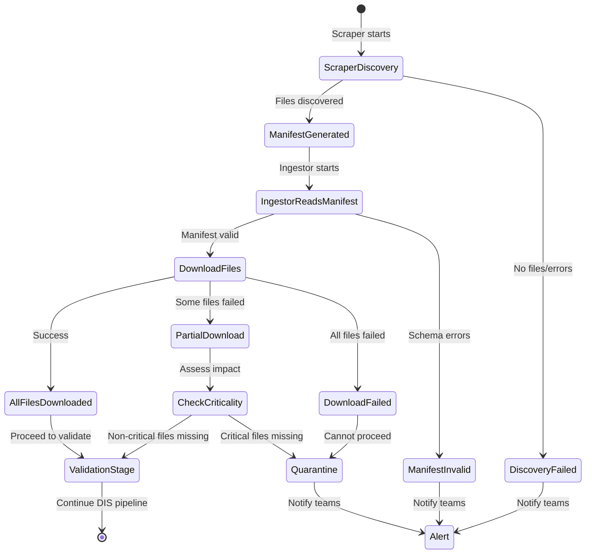

# Scraper-Ingestor Integration Reference Architecture

**Status:** Draft v1.0.1  
**Owners:** Data Engineering  
**Consumers:** Scraper Implementers, Ingestor Implementers, Platform Engineering  
**Change control:** PR review

**Cross-References:**
- **STD-scraper-prd-v1.0.md:** Scraper patterns and discovery standards
- **STD-data-architecture-prd-v1.0.md:** DIS pipeline architecture and requirements
- **STD-data-architecture-impl-v1.0.1.md:** Ingestor implementation guide with ParseResult examples
- **STD-parser-contracts-prd-v1.0.md:** Parser contracts v1.1 (ParseResult return type, 64-char hashing, schema-driven precision, content sniffing)
- **REF-cms-pricing-source-map-prd-v1.0.md:** CMS dataset source mappings
- **DOC-master-catalog-prd-v1.0.md:** Master system catalog

---

## 0. Overview & Purpose

### 0.1 Purpose

This reference architecture documents the **integration boundary** between scrapers (Discovery phase) and ingestors (Land phase) in the DIS pipeline. It defines:

- The discovery manifest as the contract between components
- File path conventions for handoff
- Metadata propagation rules
- Handoff protocols for success, partial discovery, and failures
- Working examples from MPFS, RVU, and OPPS integrations

### 0.2 Scope

**In scope:**
- Discovery manifest schema and usage
- Scraper → Ingestor handoff protocols
- File path conventions
- Metadata propagation
- Integration patterns for each data type
- Error handling at the boundary

**Out of scope:**
- Scraper implementation details (see `STD-scraper-prd-v1.0.md`)
- Ingestor implementation details (see `STD-data-architecture-impl-v1.0.md`)
- Database schema design
- API serving patterns

### 0.3 Quick Navigation

| I want to... | Go to Section |
|--------------|---------------|
| Understand responsibilities | §1.1 Responsibility Matrix (RACI) |
| See the integration flow | §1.2 State Machine Diagram |
| Learn manifest schema | §2. Discovery Manifest Contract |
| Understand file paths | §3. File Path Conventions |
| See working examples | §4. Integration Patterns by Data Type |
| Handle errors | §5. Handoff Protocols |
| Test integration | §6. Testing Integration |

---

## 1. Integration Architecture

### 1.1 Responsibility Matrix (RACI)

| Activity | Scraper | Ingestor | Manifest | Notes |
|----------|---------|----------|----------|-------|
| **Navigate CMS website** | R | - | - | Scraper owns discovery |
| **Discover file URLs** | R | I | - | Scraper finds, ingestor informed |
| **Extract metadata** | R | - | - | Size, checksum, last-modified |
| **Generate manifest** | R | C | A | Manifest is the contract |
| **Store manifest** | R | - | - | Scraper writes to disk |
| **Read manifest** | - | R | C | Ingestor reads from disk |
| **Download files** | - | R | C | Ingestor downloads from URLs |
| **Validate checksums** | I | R | C | Ingestor verifies against manifest |
| **Parse data** | - | R | I | Ingestor owns parsing |
| **Validate data** | - | R | I | Ingestor owns validation |
| **Store raw files** | - | R | - | Ingestor writes to data/raw |
| **Alert on failures** | R | R | - | Both components alert |

**Legend:** R=Responsible, A=Accountable, C=Consulted, I=Informed

**Key principle:** The manifest is the **single source of truth** for the handoff. Scrapers produce it, ingestors consume it.

### 1.2 State Machine Diagram



### 1.3 Boundary Definition

**Scraper Responsibility (Ends at Manifest):**
- ✅ Navigate CMS website structures
- ✅ Discover file URLs and metadata
- ✅ Generate discovery manifest
- ✅ Store manifest to disk
- ❌ Does NOT download actual data files
- ❌ Does NOT parse or validate content
- ❌ Does NOT write to database

**Ingestor Responsibility (Starts at Manifest):**
- ✅ Read discovery manifest
- ✅ Download files from URLs
- ✅ Validate checksums
- ✅ Parse and normalize data
- ✅ Store in database
- ❌ Does NOT navigate CMS website
- ❌ Does NOT generate manifests

**Manifest Responsibility (The Contract):**
- ✅ Defines file inventory
- ✅ Provides download URLs
- ✅ Includes metadata (checksums, sizes, timestamps)
- ✅ Immutable once written
- ✅ Versioned schema

---

## 2. Discovery Manifest Contract

### 2.1 Authoritative Source

**Location:** `cms_pricing/ingestion/metadata/discovery_manifest.py`

**Key classes:**
- `FileDiscoveryMetadata` (line 25): Per-file metadata
- `DiscoveryManifest` (line 45): Complete manifest structure
- `DiscoveryManifestStore` (line 180): Manifest persistence and retrieval

**Do not duplicate the schema here.** Reference the canonical implementation for the full specification.

### 2.2 Required Fields (Summary)

| Field | Type | Provided By | Used By | Purpose |
|-------|------|-------------|---------|---------|
| `dataset` | string | Scraper | Ingestor | Dataset identifier (e.g., "mpfs", "rvu") |
| `source_url` | string | Scraper | Ingestor | CMS page where file was discovered |
| `filename` | string | Scraper | Ingestor | File name for download |
| `file_url` | string | Scraper | Ingestor | Direct download URL |
| `content_type` | string | Scraper | Ingestor | MIME type for parsing strategy |
| `sha256` | string | Scraper | Ingestor | Expected checksum for validation |
| `size_bytes` | int | Scraper | Ingestor | Expected file size |
| `discovered_at` | datetime | Scraper | Ingestor | Discovery timestamp |
| `file_type` | string | Scraper | Ingestor | Semantic type (e.g., "pprrvu", "gpci") |
| `vintage` | string | Scraper | Ingestor | Year/quarter identifier |

**Full schema:** See `discovery_manifest.py:45-120`

### 2.3 Manifest Storage Format

**Format:** JSON Lines (JSONL) - one manifest object per line

**File naming convention:**
```
data/scraped/{source}/manifests/cms_{source}_manifest_YYYYMMDD_HHMMSS.jsonl
```

**Examples:**
- `data/scraped/mpfs/manifests/cms_mpfs_manifest_20251015_143022.jsonl`
- `data/scraped/rvu/manifests/cms_rvu_manifest_20251015_143045.jsonl`
- `data/scraped/opps/manifests/cms_opps_manifest_20251015_143108.jsonl`

**Persistence:**
- Stored on Render persistent disk
- Append-only (never modified)
- Retained per data retention policy (6 years)

### 2.4 Manifest Example (Abbreviated)

```json
{
  "dataset": "mpfs",
  "source_url": "https://www.cms.gov/medicare/medicare-fee-for-service-payment/physicianfeesched/downloads",
  "filename": "RVU25D.zip",
  "file_url": "https://www.cms.gov/files/zip/rvu25d.zip",
  "content_type": "application/zip",
  "sha256": "abc123def456...",
  "size_bytes": 5242880,
  "discovered_at": "2025-10-15T14:30:22.123456Z",
  "file_type": "rvu_bundle",
  "vintage": "2025",
  "metadata": {
    "year": 2025,
    "quarter": "D",
    "scraper_version": "1.0.0"
  }
}
```

**Full examples:** See actual manifests in `data/scraped/{mpfs,rvu,opps}/manifests/`

---

## 3. File Path Conventions

### 3.1 Scraper Output Paths

```
data/scraped/{source}/
├── manifests/
│   └── cms_{source}_manifest_YYYYMMDD_HHMMSS.jsonl  ← Discovery manifest
└── temp/                                              ← Temporary files (if any)
```

**Examples:**
- `data/scraped/mpfs/manifests/cms_mpfs_manifest_20251015_143022.jsonl`
- `data/scraped/rvu/manifests/cms_rvu_manifest_20251015_143045.jsonl`
- `data/scraped/opps/manifests/cms_opps_manifest_20251015_143108.jsonl`

### 3.2 Ingestor Input/Output Paths

```
data/
├── raw/{source}/{release_id}/
│   ├── files/                      ← Downloaded raw files
│   │   ├── RVU25D.zip
│   │   ├── cf-2025.xlsx
│   │   └── ...
│   └── manifest.json               ← Raw batch manifest (ingestor-generated)
│
├── stage/{source}/{release_id}/
│   ├── normalized.parquet          ← Normalized data
│   └── reject/                     ← Quarantined records
│
└── curated/{source}/{release_id}/
    ├── {table}.parquet             ← Curated tables
    └── metadata.json               ← Curated metadata
```

**Release ID format:** `{source}_{year}_{period}_{timestamp}`
- Example: `mpfs_2025_annual_20251015_143022`

### 3.3 Path Resolution

**How ingestors locate scraper manifests:**

```python
# Pattern from mpfs_ingestor.py:237-262
async def discover_source_files(self) -> List[SourceFile]:
    # 1. Find latest manifest
    manifest_dir = Path("data/scraped/mpfs/manifests")
    manifest_files = sorted(manifest_dir.glob("cms_mpfs_manifest_*.jsonl"))
    
    if not manifest_files:
        raise FileNotFoundError("No discovery manifest found")
    
    latest_manifest = manifest_files[-1]  # Most recent by timestamp
    
    # 2. Read manifest
    with open(latest_manifest, 'r') as f:
        manifest_data = [json.loads(line) for line in f]
    
    # 3. Convert to SourceFile objects
    source_files = []
    for entry in manifest_data:
        source_files.append(SourceFile(
            url=entry["file_url"],
            filename=entry["filename"],
            content_type=entry["content_type"],
            expected_size_bytes=entry.get("size_bytes"),
            last_modified=entry.get("last_modified"),
            checksum=entry.get("sha256")
        ))
    
    return source_files
```

**Configuration:**
- Manifest paths configurable via environment variables
- Default: relative to project root
- Render: persistent disk mounts

---

## 4. Integration Patterns by Data Type

### 4.1 Pattern Matrix

| Pattern | Scraper | Ingestor | Manifest Characteristics | Files | Example |
|---------|---------|----------|-------------------------|-------|---------|
| **Composition** | Composes multiple scrapers | Reads unified manifest | Multiple file types, single manifest | RVU bundle + CF + abstracts | MPFS |
| **Direct Links** | Extracts from single page | Processes quarterly | One manifest per quarter | Quarterly releases A/B/C/D | RVU |
| **Navigation** | Multi-page navigation | Handles redirects | Per-quarter addenda | Addendum A/B per quarter | OPPS |

### 4.2 MPFS Integration (Composition Pattern)

**Data Flow:**
```
CMSMPFSScraper
  ├─> Calls CMSRVUScraper.scrape_rvu_files()
  │   └─> Discovers: PPRRVU, GPCI, LocalityCounty, ANES, OPPSCAP
  ├─> Discovers MPFS-specific files
  │   └─> Conversion factors, abstracts, national payment
  ├─> Merges into unified manifest
  └─> Saves: data/scraped/mpfs/manifests/cms_mpfs_manifest_*.jsonl

MPFSIngestor
  ├─> Reads: data/scraped/mpfs/manifests/cms_mpfs_manifest_*.jsonl
  ├─> discover_source_files() returns List[SourceFile]
  ├─> land_stage() downloads all files
  │   └─> Writes: data/raw/mpfs/{release_id}/files/
  └─> Proceeds to validate_stage()
```

**Code references:**
- Scraper: `cms_pricing/ingestion/scrapers/cms_mpfs_scraper.py:86-136`
- Ingestor: `cms_pricing/ingestion/ingestors/mpfs_ingestor.py:237-262`
- Manifest: `data/scraped/mpfs/manifests/cms_mpfs_manifest_*.jsonl`

**Key characteristics:**
- Unified manifest covering RVU + MPFS files
- Single discovery run produces complete inventory
- Ingestor processes all files in one batch

### 4.3 RVU Integration (Direct Links Pattern)

**Data Flow:**
```
CMSRVUScraper
  ├─> Navigates: https://www.cms.gov/medicare/payment/fee-schedules/physician/pfs-relative-value-files
  ├─> Extracts direct file links: RVU24A, RVU24B, RVU24C, RVU24D
  ├─> Generates manifest per file
  └─> Saves: data/manifests/cms_rvu/cms_rvu_manifest_*.jsonl

RVUIngestor
  ├─> Reads: data/manifests/cms_rvu/cms_rvu_manifest_*.jsonl
  ├─> discover_source_files() returns quarterly releases
  ├─> land() downloads ZIP files
  │   └─> Writes: data/raw/cms_rvu/{release_id}/files/
  └─> Proceeds to validate()
```

**Code references:**
- Scraper: `cms_pricing/ingestion/scrapers/cms_rvu_scraper.py`
- Ingestor: `cms_pricing/ingestion/ingestors/rvu_ingestor.py:97`
- Manifest: `data/manifests/cms_rvu/cms_rvu_manifest_*.jsonl`

**Key characteristics:**
- Direct file links (no multi-page navigation)
- Quarterly releases as separate files
- Multiple formats per release (ZIP, TXT, CSV, XLSX)

### 4.4 OPPS Integration (Quarterly Navigation Pattern)

**Data Flow:**
```
CMSOPPSScraper
  ├─> Navigates: https://www.cms.gov/.../quarterly-addenda-updates
  ├─> For each quarter:
  │   ├─> Navigates to quarter-specific page
  │   ├─> Extracts Addendum A link
  │   ├─> Extracts Addendum B link
  │   └─> Handles AMA license interstitial
  ├─> Generates manifest per quarter
  └─> Saves: data/scraped/opps/manifests/cms_opps_manifest_*.jsonl

OPPSIngestor
  ├─> Reads: data/scraped/opps/manifests/cms_opps_manifest_*.jsonl
  ├─> discover_files() returns addenda per quarter
  ├─> _land_stage() downloads ZIP files
  │   ├─> Handles AMA license acceptance
  │   └─> Writes: data/raw/opps/{release_id}/files/
  └─> Proceeds to _validate_stage()
```

**Code references:**
- Scraper: `cms_pricing/ingestion/scrapers/cms_opps_scraper.py:85-100`
- Ingestor: `cms_pricing/ingestion/ingestors/opps_ingestor.py:52`
- Manifest: `data/scraped/opps/manifests/cms_opps_manifest_*.jsonl`

**Key characteristics:**
- Multi-page navigation required
- AMA license interstitial handling
- Quarterly addenda (A and B per quarter)

### 4.5 Template for New Integrations

**For new data types (ASC, IPPS, CLFS, etc.):**

1. **Scraper creates manifest:**
   ```python
   manifest_store = DiscoveryManifestStore(
       Path("data/scraped/{source}/manifests"),
       prefix="cms_{source}_manifest"
   )
   await manifest_store.save_manifest(discovered_files)
   ```

2. **Ingestor reads manifest:**
   ```python
   async def discover_source_files(self) -> List[SourceFile]:
       manifest_dir = Path("data/scraped/{source}/manifests")
       latest_manifest = sorted(manifest_dir.glob("cms_{source}_manifest_*.jsonl"))[-1]
       
       with open(latest_manifest, 'r') as f:
           manifest_data = [json.loads(line) for line in f]
       
       return [SourceFile(**entry) for entry in manifest_data]
   ```

3. **Follow file path conventions** (§3)
4. **Implement handoff protocols** (§5)

---

## 5. Handoff Protocols

### 5.1 Success Case (Happy Path)

**Sequence:**
1. Scraper discovers N files
2. Scraper generates complete manifest with all metadata
3. Scraper saves manifest to `data/scraped/{source}/manifests/`
4. Scraper logs success, exits
5. Ingestor reads latest manifest
6. Ingestor validates manifest schema
7. Ingestor downloads all files from URLs
8. Ingestor verifies checksums match manifest
9. Ingestor proceeds to validation stage

**Success criteria:**
- ✅ All expected files discovered
- ✅ Manifest schema valid
- ✅ All files downloadable
- ✅ Checksums match

### 5.2 Partial Discovery

**Scenario:** Scraper finds some but not all expected files

**Manifest includes:**
```json
{
  "partial_discovery": true,
  "expected_files": ["file1.zip", "file2.xlsx", "file3.csv"],
  "discovered_files": ["file1.zip", "file2.xlsx"],
  "missing_files": ["file3.csv"],
  "notes": "file3.csv not found on CMS website"
}
```

**Ingestor decision logic:**
```python
if manifest.get("partial_discovery"):
    missing = manifest.get("missing_files", [])
    
    # Check if missing files are critical
    critical_missing = [f for f in missing if f in CRITICAL_FILES]
    
    if critical_missing:
        logger.error("Critical files missing", files=critical_missing)
        raise CriticalFilesM issingError(critical_missing)
    else:
        logger.warning("Optional files missing", files=missing)
        # Proceed with available files
```

### 5.3 Discovery Failure

**Scenario:** Scraper encounters errors, no manifest generated

**Scraper behavior:**
- Log error with details
- Send alert to monitoring
- Exit with non-zero code
- Do NOT generate empty/invalid manifest

**Ingestor behavior:**
- Check for manifest presence
- If no manifest found within expected window:
  - Log warning
  - Send alert
  - Skip ingestion run
  - Retry on next scheduled run

**Monitoring:**
- Alert if no manifest generated within SLA window
- Track discovery failure rate
- Escalate if repeated failures

### 5.4 Download Failure

**Scenario:** Manifest valid, but file URLs inaccessible

**Ingestor behavior:**
```python
async def land_stage(self, source_files: List[SourceFile]) -> RawBatch:
    failed_downloads = []
    
    for source_file in source_files:
        try:
            response = await client.get(source_file.url, timeout=60.0)
            response.raise_for_status()
            
            # Verify checksum
            actual_checksum = hashlib.sha256(response.content).hexdigest()
            if actual_checksum != source_file.checksum:
                raise ChecksumMismatchError(
                    f"Expected {source_file.checksum}, got {actual_checksum}"
                )
            
            # Store file
            # ...
            
        except Exception as e:
            logger.error("Download failed", 
                        filename=source_file.filename,
                        error=str(e))
            failed_downloads.append((source_file, e))
    
    if failed_downloads:
        # Check criticality
        critical_failures = [f for f, e in failed_downloads if f.filename in CRITICAL_FILES]
        
        if critical_failures:
            raise CriticalDownloadFailure(critical_failures)
        else:
            logger.warning("Non-critical downloads failed", count=len(failed_downloads))
```

**Retry strategy:**
- Exponential backoff: 1s, 2s, 4s, 8s, 16s
- Max retries: 5
- Timeout: 60 seconds per attempt
- Alert after exhausting retries

### 5.5 Checksum Mismatch

**Scenario:** Downloaded file checksum doesn't match manifest

**Ingestor behavior:**
- Log error with both checksums
- Quarantine the file
- Alert monitoring
- Do NOT proceed with that file
- Continue with other files if non-critical

**Possible causes:**
- File changed on CMS website after discovery
- Network corruption during download
- Scraper calculated checksum incorrectly

**Resolution:**
- Re-run scraper to get updated manifest
- Verify file integrity on CMS website
- Update scraper if checksum calculation wrong

---

## 6. Testing Integration

### 6.1 Unit Testing Strategy

**Test scraper independently:**
```python
# tests/scrapers/test_mpfs_scraper_methods.py
@pytest.mark.asyncio
async def test_scraper_generates_manifest():
    scraper = CMSMPFSScraper()
    files = await scraper.scrape_mpfs_files(2025, 2025)
    
    # Verify manifest exists
    manifest_dir = Path("data/scraped/mpfs/manifests")
    manifests = list(manifest_dir.glob("cms_mpfs_manifest_*.jsonl"))
    assert len(manifests) > 0
    
    # Verify manifest schema
    with open(manifests[-1], 'r') as f:
        data = [json.loads(line) for line in f]
    
    assert all("filename" in entry for entry in data)
    assert all("sha256" in entry for entry in data)
```

**Test ingestor with fixture manifests:**
```python
# tests/ingestors/test_mpfs_ingestor_e2e.py
@pytest.fixture
def sample_manifest(tmp_path):
    """Create sample manifest for testing"""
    manifest_dir = tmp_path / "manifests"
    manifest_dir.mkdir()
    
    manifest_file = manifest_dir / "cms_mpfs_manifest_20251015_000000.jsonl"
    with open(manifest_file, 'w') as f:
        json.dump({
            "dataset": "mpfs",
            "filename": "test_file.zip",
            "file_url": "https://example.com/test.zip",
            "sha256": "abc123...",
            # ... other fields
        }, f)
    
    return manifest_file

@pytest.mark.asyncio
async def test_ingestor_reads_manifest(sample_manifest):
    ingestor = MPFSIngestor()
    source_files = await ingestor.discover_source_files()
    
    assert len(source_files) > 0
    assert source_files[0].filename == "test_file.zip"
```

### 6.2 Integration Testing

**End-to-end test with real scraper + ingestor:**
```python
# tests/integration/test_scraper_ingestor_integration.py
@pytest.mark.asyncio
@pytest.mark.integration
async def test_mpfs_end_to_end_integration():
    # 1. Run scraper
    scraper = CMSMPFSScraper()
    await scraper.scrape_mpfs_files(2025, 2025, latest_only=True)
    
    # 2. Verify manifest generated
    manifest_dir = Path("data/scraped/mpfs/manifests")
    manifests = list(manifest_dir.glob("cms_mpfs_manifest_*.jsonl"))
    assert len(manifests) > 0
    
    # 3. Run ingestor discovery
    ingestor = MPFSIngestor()
    source_files = await ingestor.discover_source_files()
    assert len(source_files) > 0
    
    # 4. Run land stage
    raw_batch = await ingestor.land_stage(source_files)
    assert raw_batch.batch_id
    assert len(raw_batch.raw_data) > 0
```

### 6.3 Error Injection Testing

**Test partial discovery:**
```python
@pytest.mark.asyncio
async def test_partial_discovery_handling():
    # Create manifest with partial_discovery flag
    manifest = create_partial_manifest(missing_files=["optional_file.csv"])
    
    ingestor = MPFSIngestor()
    source_files = await ingestor.discover_source_files()
    
    # Should proceed with available files
    assert len(source_files) > 0
```

**Test download failure:**
```python
@pytest.mark.asyncio
async def test_download_failure_handling():
    # Create manifest with invalid URL
    manifest = create_manifest_with_invalid_url()
    
    ingestor = MPFSIngestor()
    source_files = await ingestor.discover_source_files()
    
    # Should quarantine and alert
    with pytest.raises(DownloadFailureError):
        await ingestor.land_stage(source_files)
```

### 6.4 Test Fixtures

**Location:** `tests/fixtures/manifests/`

**Fixture manifests:**
- `sample_mpfs_manifest.jsonl` - Complete MPFS manifest
- `sample_rvu_manifest.jsonl` - RVU quarterly manifest
- `sample_opps_manifest.jsonl` - OPPS addenda manifest
- `partial_discovery_manifest.jsonl` - Partial discovery scenario
- `invalid_url_manifest.jsonl` - Download failure scenario

---

## 7. Error Handling & Monitoring

### 7.1 Error Taxonomy

| Error Type | Owned By | Detection Point | Resolution | Alert Level |
|------------|----------|-----------------|------------|-------------|
| **Discovery failure** | Scraper | Scraper execution | Fix scraper, re-run | ERROR |
| **Manifest invalid** | Scraper | Ingestor validation | Fix manifest schema | CRITICAL |
| **Manifest not found** | Integration | Ingestor discovery | Check scraper ran, check paths | ERROR |
| **File URL 404** | Scraper | Ingestor download | Re-run scraper, verify CMS | ERROR |
| **File URL 403/401** | Scraper | Ingestor download | Check auth, license acceptance | ERROR |
| **Checksum mismatch** | Integration | Ingestor validation | Re-download, re-run scraper | WARNING |
| **Timeout** | Network | Ingestor download | Retry with backoff | WARNING |
| **Partial download** | Network | Ingestor download | Retry failed files | WARNING |

### 7.2 Monitoring Points

**Scraper metrics:**
- Discovery success rate (%)
- Files discovered per run
- Manifest generation time (seconds)
- Discovery failures (count)

**Ingestor metrics:**
- Manifest read success rate (%)
- Download success rate (%)
- Checksum validation success rate (%)
- Files downloaded per run
- Download time per file (seconds)

**Integration metrics:**
- End-to-end latency (discovery → land complete)
- Integration failure rate (%)
- Manifest age when ingested (hours)

**Monitoring implementation:**
- Structured logs with metrics
- Prometheus/Grafana dashboards
- Render monitoring integration

### 7.3 Alerting Rules

**Discovery failures:**
- Alert if scraper fails 2+ consecutive runs
- Severity: ERROR
- Notify: Data Engineering

**Download failures:**
- Alert if >10% of files fail to download
- Severity: ERROR
- Notify: Data Engineering + Ops

**Checksum mismatches:**
- Alert on any checksum mismatch
- Severity: WARNING
- Notify: Data Engineering

**Manifest age:**
- Alert if manifest >7 days old and no new discovery
- Severity: WARNING
- Notify: Data Engineering

---

## 8. Deployment & Operations (Render)

### 8.1 Render Deployment Architecture

**Scrapers:**
- Deployed as Render Cron Jobs
- Schedule: Weekly discovery runs
- Persistent disk: `/data/scraped` (mounted volume)
- Logs: Render logging integration

**Ingestors:**
- Deployed as Render Background Workers
- Triggered: After successful scraper run or scheduled
- Persistent disk: `/data` (mounted volume for raw/stage/curated)
- Database: Render PostgreSQL

**Manifest storage:**
- Render persistent disk (primary)
- PostgreSQL (backup/audit trail)
- No S3 dependencies

### 8.2 Scheduling & Coordination

**Scraper schedule (Render Cron):**
```yaml
# render.yaml
services:
  - type: cron
    name: cms-mpfs-scraper
    schedule: "0 9 * * 1"  # Monday 9 AM
    buildCommand: pip install -r requirements.txt
    startCommand: python -m cms_pricing.ingestion.scrapers.cli scrape mpfs
    disk:
      name: scraped-data
      mountPath: /data/scraped
      sizeGB: 10
```

**Ingestor trigger:**
- Option A: Scheduled after scraper (e.g., Monday 10 AM)
- Option B: File watcher on manifest directory
- Option C: Manual trigger via API endpoint

**Coordination:**
- Ingestor checks for manifest presence
- If no new manifest, skip run
- If new manifest, proceed with ingestion

### 8.3 Failure Recovery

**Scraper failure:**
- Automatic retry on next scheduled run
- Manual retry via Render dashboard
- No impact on existing manifests (immutable)

**Ingestor failure:**
- Manifest remains available for retry
- Manual retry via API or Render dashboard
- Quarantined data preserved for analysis

**State tracking:**
- Discovery runs tracked in PostgreSQL
- Ingestion runs tracked in `runs` table
- Manifest → Run linkage maintained

---

## 9. Metadata Propagation

### 9.1 Required Metadata Flow

| Metadata | Scraper → Manifest | Manifest → Ingestor | Ingestor → Database |
|----------|-------------------|---------------------|---------------------|
| **discovered_at** | ✅ Scraper timestamp | ✅ Read by ingestor | ✅ Stored as `discovery_timestamp` |
| **source_url** | ✅ CMS page URL | ✅ Preserved | ✅ Stored in `runs` table |
| **sha256** | ✅ Calculated by scraper | ✅ Validated by ingestor | ✅ Stored for audit |
| **file_type** | ✅ Semantic type | ✅ Used for parsing | ✅ Stored as `file_category` |
| **vintage** | ✅ Year/quarter | ✅ Used for release_id | ✅ Stored as `vintage_date` |

### 9.2 Optional Metadata

| Metadata | Purpose | Propagation |
|----------|---------|-------------|
| **last_modified** | Freshness tracking | Scraper → Manifest → Observability |
| **size_bytes** | Download validation | Scraper → Manifest → Download check |
| **scraper_version** | Debugging | Scraper → Manifest → Audit logs |
| **notes** | Human context | Scraper → Manifest → Logs |

### 9.3 Lineage Tracking

**Full lineage chain:**
```
CMS Website
  ↓ (discovered_at, source_url)
Discovery Manifest
  ↓ (manifest_id, discovered_files)
Raw Batch
  ↓ (batch_id, raw_files)
Adapted Batch
  ↓ (batch_id, normalized_data)
Stage Frame
  ↓ (batch_id, enriched_data)
Curated Tables
  ↓ (release_id, vintage_date)
API Responses
```

**Tracking implementation:**
- Manifest ID → stored in `runs.discovery_manifest_id`
- Batch ID → stored in `runs.batch_id`
- Release ID → stored in `runs.release_id`
- Full lineage queryable via `runs` and `snapshots` tables

---

## 10. Anti-Patterns & Common Mistakes

### 10.1 Anti-Pattern: Tight Coupling

**❌ Wrong:**
```python
class MyIngestor(BaseDISIngestor):
    async def discover_source_files(self):
        # Calling scraper directly
        scraper = CMSMPFSScraper()
        files = await scraper.scrape_mpfs_files(2025, 2025)
        return files  # Tightly coupled!
```

**✅ Correct:**
```python
class MyIngestor(BaseDISIngestor):
    async def discover_source_files(self):
        # Reading manifest (loose coupling)
        manifest_path = self._find_latest_manifest()
        manifest_data = self._read_manifest(manifest_path)
        return self._convert_to_source_files(manifest_data)
```

### 10.2 Anti-Pattern: Duplicate Downloads

**❌ Wrong:**
- Scraper downloads files for validation
- Ingestor re-downloads same files

**✅ Correct:**
- Scraper only discovers URLs and metadata
- Ingestor downloads once

### 10.3 Anti-Pattern: Metadata Loss

**❌ Wrong:**
```python
# Ignoring manifest metadata
source_files = [SourceFile(url=entry["file_url"], filename=entry["filename"])]
# Lost: checksum, size, timestamps, vintage
```

**✅ Correct:**
```python
# Preserving all metadata
source_files = [SourceFile(
    url=entry["file_url"],
    filename=entry["filename"],
    content_type=entry["content_type"],
    expected_size_bytes=entry["size_bytes"],
    last_modified=entry.get("last_modified"),
    checksum=entry["sha256"]
)]
```

### 10.4 Anti-Pattern: Path Hardcoding

**❌ Wrong:**
```python
manifest_path = "/Users/alex/cms-api/data/scraped/mpfs/manifests/cms_mpfs_manifest_20251015_143022.jsonl"
```

**✅ Correct:**
```python
manifest_dir = Path(self.output_dir) / "scraped" / "mpfs" / "manifests"
latest_manifest = sorted(manifest_dir.glob("cms_mpfs_manifest_*.jsonl"))[-1]
```

### 10.5 Anti-Pattern: Silent Failures

**❌ Wrong:**
```python
try:
    manifest = read_manifest()
except FileNotFoundError:
    return []  # Silent failure!
```

**✅ Correct:**
```python
try:
    manifest = read_manifest()
except FileNotFoundError as e:
    logger.error("Manifest not found", error=str(e))
    self.observability_collector.record_failure("manifest_not_found")
    raise  # Propagate error
```

---

## Appendix A: Full Manifest Schema Reference

**Authoritative source:** `cms_pricing/ingestion/metadata/discovery_manifest.py:45-120`

**Key classes:**
- `FileDiscoveryMetadata` - Per-file metadata structure
- `DiscoveryManifest` - Complete manifest container
- `DiscoveryManifestStore` - Persistence and retrieval

**Do not duplicate schema here.** Always reference the canonical implementation.

---

## Appendix B: File Path Reference Table

| Component | Path Pattern | Example |
|-----------|--------------|---------|
| **Scraper manifest** | `data/scraped/{source}/manifests/cms_{source}_manifest_YYYYMMDD_HHMMSS.jsonl` | `data/scraped/mpfs/manifests/cms_mpfs_manifest_20251015_143022.jsonl` |
| **Raw files** | `data/raw/{source}/{release_id}/files/{filename}` | `data/raw/mpfs/mpfs_2025_annual_20251015_143022/files/RVU25D.zip` |
| **Raw manifest** | `data/raw/{source}/{release_id}/manifest.json` | `data/raw/mpfs/mpfs_2025_annual_20251015_143022/manifest.json` |
| **Stage files** | `data/stage/{source}/{release_id}/normalized.parquet` | `data/stage/mpfs/mpfs_2025_annual_20251015_143022/normalized.parquet` |
| **Quarantine** | `data/stage/{source}/{release_id}/reject/` | `data/stage/mpfs/mpfs_2025_annual_20251015_143022/reject/` |
| **Curated** | `data/curated/{source}/{release_id}/{table}.parquet` | `data/curated/mpfs/mpfs_2025_annual_20251015_143022/mpfs_rvu.parquet` |

---

## Appendix C: Complete Manifest Examples

**MPFS Manifest (Full):**
```json
{
  "dataset": "mpfs",
  "source_url": "https://www.cms.gov/medicare/medicare-fee-for-service-payment/physicianfeesched/downloads",
  "filename": "RVU25D.zip",
  "file_url": "https://www.cms.gov/files/zip/rvu25d.zip",
  "content_type": "application/zip",
  "sha256": "a1b2c3d4e5f6789012345678901234567890abcdef1234567890abcdef123456",
  "size_bytes": 5242880,
  "discovered_at": "2025-10-15T14:30:22.123456Z",
  "last_modified": "2025-10-01T08:00:00.000000Z",
  "file_type": "rvu_bundle",
  "vintage": "2025",
  "metadata": {
    "year": 2025,
    "quarter": "D",
    "scraper_version": "1.0.0",
    "discovery_method": "composition",
    "composed_with": "cms_rvu_scraper"
  }
}
```

**Real examples:** See `data/scraped/{mpfs,rvu,opps}/manifests/` for actual manifests.

---

## Appendix D: Maintenance & Ownership

### D.1 Document Owner

**Primary owner:** Data Engineering  
**Reviewers:** Platform Engineering, QA Guild

### D.2 Update Triggers

Update this document when:
- Discovery manifest schema changes
- New integration pattern emerges
- File path conventions change
- New data type added (ASC, IPPS, etc.)
- Handoff protocol changes
- CMS website structure changes significantly

### D.3 Review Cadence

**Quarterly review** (aligned with Master Catalog review)
- Verify code references are still accurate
- Update examples if implementations changed
- Add new patterns as they emerge
- Remove deprecated patterns

### D.4 Maintenance Checklist

-  Verify `discovery_manifest.py` line numbers are current
-  Check ingestor file references are accurate
-  Update manifest examples if schema evolved
-  Add new data types as they're implemented
-  Review error taxonomy for completeness
-  Update monitoring metrics if changed

---

## Change Log

| Date | Version | Author | Summary |
|------|---------|--------|---------|
| 2025-10-15 | v1.0.1 | Data Engineering | Updated cross-references to STD-parser-contracts v1.1 (ParseResult return type, 64-char hashing). Updated STD-data-architecture-impl to v1.0.1 with ParseResult examples. Reflects ingestor-owned artifact writes per parser contracts. |
| 2025-10-15 | v1.0 | Data Engineering | Initial scraper-ingestor integration reference: RACI matrix, state machine, manifest contract, file path conventions, integration patterns (MPFS/RVU/OPPS), handoff protocols, error handling, testing patterns, Render deployment, anti-patterns, and maintenance guidance. |

